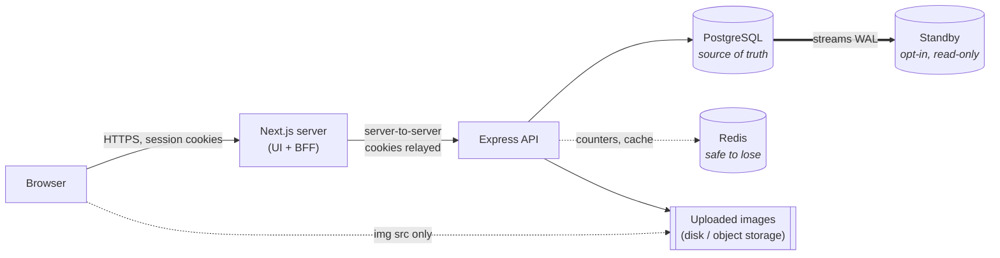

# Architecture

Kintsugi is a four-container system: a Next.js server, an Express API,
PostgreSQL, and Redis — plus an optional fifth, a streaming Postgres standby.
The browser talks only to Next.js.

The dotted line to Redis is the point: pull it out and the site is slower and
still correct.

Nothing points *at* the standby, and that is also the point. It is a spare
primary, not a read replica — see
[ADR 0020](../adr/0020-replication-and-backups.md).

Documentation is split by the level of detail you need, following the
[C4 model](https://c4model.com)'s idea of separate diagrams for separate
audiences:

| Level | Document | Answers |
| --- | --- | --- |
| Context + Container | [hld.md](hld.md) | What are the moving parts, and how does a request flow through them? |
| Component + Code | [lld.md](lld.md) | What is each module responsible for, and how do the tricky flows actually work? |
| Data | [data-model.md](data-model.md) | What is stored, and what are the invariants? |
| Interface | [../api.md](../api.md) | What endpoints exist? |
| Rationale | [../adr/](../adr/README.md) | Why is it like this and not otherwise? |

## The five ideas that explain most of the code

1. **The Next.js server is the only thing the browser trusts.** Every API call
   goes through a BFF route handler, so the Express address is never exposed
   and there is no CORS story on the client.
   → [ADR 0002](../adr/0002-bff-proxy.md)

2. **Selling is a capability, not an account type.** One `User` row; a
   `SellerProfile` appears when they start selling.
   → [ADR 0003](../adr/0003-unified-account.md)

3. **Money is integers.** `priceCents`, never a float, from the database to the
   HTTP boundary. Formatting happens in the UI only.
   → [ADR 0005](../adr/0005-money-as-integer-minor-units.md)

4. **Identity documents are never stored.** Verification is delegated; we keep
   a reference to the outcome and nothing else.
   → [ADR 0006](../adr/0006-kyc-store-reference-not-document.md)

5. **Displayed facts trace to rows.** Ratings are aggregated from `Review`
   records rather than stored as a number, so a rating always corresponds to
   reviews that exist.
   → [ADR 0009](../adr/0009-computed-ratings.md)

6. **Postgres is the only source of truth.** Anything that must be correct
   under concurrency arbitrates there — stock under a row lock, the payment
   claim, refund headroom, TOTP replay. Redis holds only counters that expire
   and copies that can be rebuilt, so losing it costs latency and never data.
   → [ADR 0018](../adr/0018-redis-for-shared-ephemeral-state.md)
