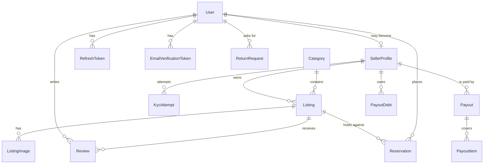

# Data Model

PostgreSQL 16, managed by Prisma 7. Source of truth:
[`backend/prisma/schema.prisma`](../../backend/prisma/schema.prisma).

---

## Entity relationships



## Tables

### `users`

The account. One row per person, whether they buy, sell, or both.

| Column | Type | Notes |
| --- | --- | --- |
| `id` | uuid | PK |
| `email` | text | Unique |
| `passwordHash` | text | bcrypt, cost 12 |
| `name` | text | |
| `isSeller` | bool | Capability flag, not an account type |
| `emailVerified` | bool | Login is blocked until true |
| `avatarUrl` | text? | Public URL of the stored avatar. **The image lives in object storage, never here.** Null falls back to generated initials |
| `phone` | text? | Unique. E.164 only. **Never populated from `addresses.phone`** — see below |
| `phoneVerifiedAt` | timestamp? | **The gate.** Nothing is ever sent to a number whose value here is null |
| `smsConsentAt` | timestamp? | Separate from verification: proving a number works is not agreeing to be messaged on it, and it is the consent that has to be produced if anyone asks |
| `createdAt` / `updatedAt` | timestamp | |

`phone` is unique, and that is a trade rather than an obvious win. It buys the
property that one number cannot verify unlimited accounts — a verified phone is
only an identity signal if it is scarce. It costs the case where a number held
by a suspended account cannot be reused by its owner elsewhere, which is a
support ticket rather than a security hole. Postgres permits many NULLs in a
unique index, so accounts without a number are unaffected.

### `refresh_tokens`

| Column | Type | Notes |
| --- | --- | --- |
| `id` | uuid | PK |
| `userId` | uuid | FK → users, cascade |
| `tokenHash` | text | Unique. **SHA-256 of the token** — the plaintext is never stored |
| `expiresAt` | timestamp | 30 days from issue |
| `revokedAt` | timestamp? | Set on logout or on reuse detection |
| `replacedByTokenHash` | text? | Rotation chain; presenting a replaced token means it leaked |

### `email_verification_tokens`

| Column | Type | Notes |
| --- | --- | --- |
| `tokenHash` | text | Unique, hashed like refresh tokens |
| `expiresAt` | timestamp | 24 hours |
| `usedAt` | timestamp? | Enforces single use |

### `seller_profiles`

One-to-one with `users`, created when someone starts selling. Separate from
`users` so verification and payout state don't bloat the row read on every
authenticated request.

| Column | Type | Notes |
| --- | --- | --- |
| `userId` | uuid | Unique FK → users, cascade |
| `shopName` | text | Defaults to the user's name |
| `bio` | text? | |
| `kycStatus` | enum | `UNSTARTED` / `PENDING` / `VERIFIED` / `REJECTED` |
| `kycProvider` | text? | e.g. `stub`, `stripe_identity` |
| `kycSessionId` | text? | Provider's session reference for the latest attempt |
| `kycDocType` | text? | `passport` / `drivers_license` / `national_id` |
| `kycCountry` | text? | ISO 3166-1 alpha-2 |
| `kycVerifiedAt` | timestamp? | |
| `kycRejectionReason` | text? | Cleared on success |
| `payoutsEnabled` | bool | **Our** gate. True only alongside a `VERIFIED` decision |
| `payoutsReady` | bool | **The provider's** gate, mirrored from Connect's `payouts_enabled` |
| `connectAccountId` | text? | Unique. The connected account, reused rather than recreated |
| `connectOnboardedAt` | timestamp? | When details were submitted — not the same as ready |

**Two gate columns, not one.** `payoutsEnabled` is this platform's identity
decision; `payoutsReady` is Stripe's answer about whether it can pay this
account. Both must be true before a transfer, and the `account.updated` webhook
writes only the second — a webhook that could open the first would make
[ADR 0007](../adr/0007-verification-gates-payouts.md) decorative.
→ [ADR 0030](../adr/0030-payout-eligibility-and-hold.md)

**No document data is stored here.** No image, no document number, no date of
birth. Only a reference to the provider's decision.
→ [ADR 0006](../adr/0006-kyc-store-reference-not-document.md)

### `kyc_attempts`

Audit trail. `seller_profiles` holds current state; this holds history.

| Column | Type | Notes |
| --- | --- | --- |
| `sellerProfileId` | uuid | FK, cascade, indexed |
| `provider` | text | |
| `providerSessionId` | text | Unique — the match key for a decision |
| `status` | enum | `PENDING` → `VERIFIED` \| `REJECTED` |
| `documentType` / `country` | text? | Non-sensitive descriptors only |
| `rejectionReason` | text? | |
| `createdAt` / `completedAt` | timestamp | |

### `categories`

| Column | Type | Notes |
| --- | --- | --- |
| `slug` | text | Unique; the public URL segment |
| `title` / `description` | text | |
| `coverImage` | text | |
| `position` | int | Display order |

### `listings`

| Column | Type | Notes |
| --- | --- | --- |
| `id` | uuid | PK |
| `slug` | text | Unique. Generated at creation and **never regenerated**, so links survive renames |
| `sellerId` | uuid | FK → seller_profiles, cascade, indexed |
| `categoryId` | uuid | FK → categories, indexed |
| `title` / `description` | text | |
| `condition` | enum | `LIKE_NEW` / `GOOD` / `WELL_LOVED` / `NEEDS_REPAIR` — drives filtering |
| `conditionNote` | text? | Seller's own wording — what the card shows |
| `priceCents` | int | **Integer minor units.** Never a float |
| `originalPriceCents` | int? | Must exceed `priceCents` if set |
| `currency` | text | ISO 4217, default `USD` |
| `quantity` | int | Default 1 — most secondhand goods are unique |
| `status` | enum | See the [lifecycle](lld.md#4-listing-lifecycle) |
| `featured` | bool | Hand-curation for the "Picked for you" shelf. Not personalisation |
| `deletedAt` | timestamp? | Soft delete |

Indexed on `categoryId`, `sellerId`, `status`, `createdAt`, `featured` — the
five columns the catalog filters and sorts on.

### `listing_images`

| Column | Type | Notes |
| --- | --- | --- |
| `listingId` | uuid | FK, cascade, indexed |
| `url` | text | Public URL of the processed WebP |
| `alt` | text? | Defaults to the listing title |
| `position` | int | **0 is the cover** |

Rows only ever reference images that have been re-encoded and stripped of
metadata; originals are never persisted.

### `reviews`

| Column | Type | Notes |
| --- | --- | --- |
| `listingId` | uuid | FK, cascade, indexed |
| `authorId` | uuid | FK → users, cascade |
| `rating` | int | 1–5 whole stars |
| `body` | text? | |

`@@unique([listingId, authorId])` — one review per person per listing.

**There is no stored aggregate.** Averages are computed from these rows, so a
displayed rating always corresponds to reviews that exist.
→ [ADR 0009](../adr/0009-computed-ratings.md)

### `reservations`

A time-limited hold on stock, taken before checkout. Only `HELD` rows consume
availability.

| Column | Type | Notes |
| --- | --- | --- |
| `listingId` | uuid | FK, cascade, indexed |
| `userId` | uuid | FK → users, cascade |
| `quantity` | int | How much stock this hold consumes |
| `status` | enum | `HELD` → `RELEASED` \| `CONVERTED` \| `EXPIRED` |
| `expiresAt` | timestamp | 15 minutes from creation, indexed |
| `releasedAt` | timestamp? | Set when released or expired |

A **partial unique index** — `("listingId","userId") WHERE status = 'HELD'` —
enforces one live hold per buyer per listing. It is hand-written in the migration
because Prisma cannot express partial indexes, and a plain `@@unique` would also
constrain `RELEASED` rows and stop a buyer re-reserving something they let go.

Availability is decided under a `SELECT … FOR UPDATE` lock on the listing row, so
two buyers can never both claim the same unique item.
→ [ADR 0012](../adr/0012-row-locking-for-reservations.md)

### `wishlist_items`

A saved listing. Deliberately the **opposite** of a reservation: no quantity, no
expiry, and no effect whatsoever on availability. Two people can save the same
one-of-a-kind chair and neither has claimed anything.

| Column | Type | Notes |
| --- | --- | --- |
| `userId` | uuid | FK → users, cascade |
| `listingId` | uuid | FK → listings, cascade |

`@@unique([userId, listingId])` makes saving idempotent. A double-tapped heart,
or the same listing open in two tabs, cannot produce two rows — the app relies
on the index rather than checking first and inserting after, which is the same
read-then-write race as ADR 0012.

### `addresses`

Where orders get delivered. **Soft-deleted, and never referenced by an order.**

| Column | Type | Notes |
| --- | --- | --- |
| `userId` | uuid | FK → users, cascade |
| `fullName`, `line1`, `line2?`, `city`, `region?`, `postcode` | text | Loose by design |
| `country` | text | ISO 3166-1 alpha-2 |
| `phone` | text? | For the courier |
| `isDefault` | bool | At most one live row per user |
| `deletedAt` | timestamp? | Soft delete |

Only `country` is validated strictly. Address formats differ enough between
countries that structured rules reject more real addresses than they catch bad
ones — a UK postcode, an Irish Eircode, and a Hong Kong address with no postcode
are all legitimate.

"At most one default" is enforced **in a transaction**, not by a constraint:
Prisma cannot express a partial unique index on
`isDefault = true AND deletedAt IS NULL`.

### `orders`

| Column | Type | Notes |
| --- | --- | --- |
| `reference` | text | Unique, human-facing (`KIN-XXXXXX`), no O/0 or I/1 |
| `buyerId` | uuid | FK → users, cascade |
| `status` | enum | Payment state only |
| `subtotalCents` | int | Integer minor units |
| `paymentIntentId` | text? | **Unique** — one payment per order |
| `shipTo*` | text? | Eight columns: a **snapshot**, not a relation |

The `shipTo*` columns are copied from an `Address` at checkout. A foreign key
would let last year's parcel silently move house when the buyer edits their
address book, and would break outright if they deleted it.

`paymentIntentId` being unique is what the double-charge defence rests on, and
is why a basket is **not** split into one order per seller.

### `order_items`

| Column | Type | Notes |
| --- | --- | --- |
| `orderId` | uuid | FK, cascade |
| `listingId` | uuid? | SetNull — an order outlives a deleted listing |
| `sellerId` | uuid? | SetNull → seller_profiles |
| `title`, `unitPriceCents`, `sellerName` | — | Snapshots at purchase |
| `fulfilment` | enum | Per line, not per order |
| `shippedAt`, `deliveredAt`, `carrier`, `trackingNumber`, `fulfilmentNote` | — | |

`sellerId` is the field that makes a seller sales view possible at all. Lines
previously carried only `sellerName` — a display string, not something to query
by — which is why sellers could not see their own orders.

Fulfilment lives here rather than on `orders` because a basket can span several
sellers, and two sellers cannot share one parcel. "Your order has shipped" is
not something that can honestly be said about a whole order.

---

### `payouts`

One request to move a seller's money. Created `PENDING` **before** the provider
is called, so a crash in between is visible as an unfinished payout rather than
an unrecoverable one.
→ [ADR 0029](../adr/0029-payouts-separate-transfers-not-destination-charges.md)

| Column | Type | Notes |
| --- | --- | --- |
| `sellerId` | uuid | FK → seller_profiles, cascade |
| `amountCents` | int | Sum of its items, less any debt netted off at claim time |
| `nettedCents` | int | What was withheld to settle an earlier failed reversal |
| `currency` | text | `USD`. Nothing here is multi-currency |
| `status` | enum | `PENDING` / `PAID` / `FAILED` |
| `provider` | text? | `stub` or `stripe_connect` |
| `providerTransferId` | text? | Unique. A **reference** to the transfer, never a copy of it |
| `failureReason` | text? | The provider's own words, so a seller is told something actionable |
| `completedAt` | timestamp? | Null while `PENDING` |

The payout's own id is the provider's **idempotency key**. A retry after a
timeout is the one case where this platform genuinely cannot tell whether the
money already moved, so the key has to be stable across retries and unique per
payout — which is exactly what a primary key is.

A `FAILED` payout releases its lines: they become payable again. A `PENDING`
one does not.

### `payout_items`

Which lines a payout covered, and the table that makes double-payment
impossible.

| Column | Type | Notes |
| --- | --- | --- |
| `payoutId` | uuid | FK → payouts, cascade |
| `orderItemId` | text | **Unique.** Deliberately *not* a foreign key |
| `amountCents` | int | Snapshotted at claim time |
| `reversedAt` | timestamp? | Set when a refund arrived after this line was paid |
| `providerReversalId` | text? | Reference to the reversal |

**`orderItemId` is unique, and that single index is the whole defence.** Both
the eligibility query and the claim run in every concurrent payout attempt, and
both will happily agree the same $50 is payable. The transaction that inserts
first wins; the second fails on the constraint and rolls back its entire payout.
A check-then-write version would let two runs read one balance and send it
twice — the same bug shape as the five-simultaneous-charges one, with the same
fix ([ADR 0013](../adr/0013-payment-provider-seam.md),
[ADR 0016](../adr/0016-refunds-claim-then-refund.md)).

**Not a relation, on purpose.** A payout statement has to stay readable after a
listing is deleted, for the same reason `OrderItem.listingId` is nullable.

`amountCents` is snapshotted for the same reason an order copies the shipping
address: what a seller was paid must not change when a price does.

`reversedAt` lives on the item rather than the payout because a refund is per
line, so only part of a payout may come back.

### `payout_debts`

What a seller owes back when a refund landed after they were paid **and** the
provider refused to reverse the transfer.

| Column | Type | Notes |
| --- | --- | --- |
| `sellerId` | uuid | FK → seller_profiles, cascade |
| `amountCents` | int | |
| `currency` | text | `USD` |
| `reason` | text | Why it exists, for a support conversation |
| `orderItemId` | text? | The line that caused it, for tracing. Not a relation |
| `settledAt` | timestamp? | Null until a later payout absorbs it |

**Netted off, never invoiced.** The shortfall comes out of whatever the seller
is owed next. A seller who never sells again keeps it — chasing the money would
cost more than it recovers, and inventing a debt-collection path for a platform
that takes no cut is not a trade worth making.
→ [ADR 0030](../adr/0030-payout-eligibility-and-hold.md)

### `return_requests`

A buyer asking for their money back on one line. A **request**, which may be
answered no — not a refund.
→ [ADR 0031](../adr/0031-buyer-initiated-returns.md)

| Column | Type | Notes |
| --- | --- | --- |
| `orderItemId` | text | **Unique.** Deliberately not a foreign key |
| `orderId` | uuid | FK → orders, cascade |
| `buyerId` | uuid | FK → users, cascade. Always the buyer on the order |
| `status` | enum | `OPEN` → `APPROVED` / `REFUSED` / `WITHDRAWN`; `REFUSED` → `ESCALATED` → `APPROVED` / `REJECTED` |
| `reason` | text | The buyer's own words, shown to the seller verbatim |
| `notAsDescribed` | bool | Misdescribed rather than unwanted. Recorded, not yet acted on |
| `decisionNote` | text? | The answer, in the answerer's words. Required to refuse |
| `decidedById` | text? | The seller's user id, or the moderator's |
| `refundId` | text? | **Unique.** Set only on `APPROVED` |

**A separate table from `refunds`, on purpose.** A refund is money moving; this
is a question that may be answered no. Putting a status on `Refund` instead
would make a refused return indistinguishable from a **FAILED** refund in the
one table the finance view reads, and would force the over-refund guard — a
conditional `UPDATE` on `Order.refundedCents`, and the reason two clicks cannot
refund twice — to start reasoning about refunds that were only ever asked for.

**`orderItemId` is unique, and that index is the whole safety.** Two taps on
"Start a return" race, and the second collides here rather than opening a rival
request against one line that then gets answered separately. Same discipline as
`payout_items.orderItemId` ([ADR 0030](../adr/0030-payout-eligibility-and-hold.md)),
and not a foreign key for the same reason: a return has to stay readable after a
listing is deleted.

**`refundId` is unique** so one request can never be credited twice.

## Enums

| Enum | Values |
| --- | --- |
| `ListingStatus` | `DRAFT`, `ACTIVE`, `RESERVED`, `SOLD`, `REMOVED` |
| `Condition` | `LIKE_NEW`, `GOOD`, `WELL_LOVED`, `NEEDS_REPAIR` |
| `VerificationStatus` | `UNSTARTED`, `PENDING`, `VERIFIED`, `REJECTED` |
| `ReservationStatus` | `HELD`, `RELEASED`, `CONVERTED`, `EXPIRED` |
| `OrderStatus` | `PENDING_PAYMENT`, `PROCESSING`, `PAID`, `FAILED`, `CANCELLED`, `REFUNDED` |
| `FulfilmentStatus` | `UNFULFILLED`, `SHIPPED`, `DELIVERED`, `UNFULFILLABLE` |
| `PayoutStatus` | `PENDING`, `PAID`, `FAILED` |
| `ReturnStatus` | `OPEN`, `APPROVED`, `REFUSED`, `ESCALATED`, `REJECTED`, `WITHDRAWN` |

`OrderStatus` and `FulfilmentStatus` are deliberately separate. Payment and
delivery are independent facts — an order is `PAID` *and* `UNFULFILLED` for as
long as it takes a seller to reach a post office, and one enum cannot hold both.
`PROCESSING` is the mutual-exclusion state that prevents double charging.

## Invariants

Enforced in the application layer unless noted:

1. A visible listing satisfies `status = ACTIVE AND deletedAt IS NULL`.
2. `payoutsEnabled = true` only alongside `kycStatus = VERIFIED`, written in one
   transaction.
3. `isSeller = true` iff a `SellerProfile` exists — both written in one
   transaction by `POST /auth/become-seller`.
4. A published listing has at least one `ListingImage`.
5. `originalPriceCents > priceCents` when set.
6. One review per `(listing, author)` — enforced by the database.
7. A listing's `slug` never changes after creation.
8. `Listing.quantity` never goes negative — enforced by deciding availability
   under a row lock, not by a check constraint.
9. At most one `HELD` reservation per (listing, buyer) — enforced by the
   database.
10. One payment per order — `paymentIntentId` is unique, enforced by the
    database. This is what makes splitting a basket across orders impossible
    without breaking the double-charge defence.
11. An order's `shipTo*` is immutable once written. Editing or deleting the
    `Address` it came from must never change it.
12. One wishlist row per (user, listing) — enforced by the database.
13. `payoutsEnabled` and a `VERIFIED` decision are written in the same
    transaction, so payouts can never be enabled without a recorded decision
    beside them.
14. A review requires a `PAID` order containing that listing, and a seller can
    never review their own — checked in that order, so a seller is told they own
    it rather than being sent off to buy it.
15. Fulfilment only advances `UNFULFILLED → SHIPPED → DELIVERED`, and only on
    `PAID` orders. `DELIVERED` is set by the **buyer**, never the seller.
16. **`Order.refundedCents` never exceeds `subtotalCents`** — enforced by the
    conditional UPDATE that reserves headroom before any refund is issued, not
    by a check constraint, because the guard has to run *before* the provider
    call rather than reject the write afterwards.
17. The sum of a refund's `SUCCEEDED` and `PENDING` rows equals its order's
    `refundedCents`. `FAILED` rows are excluded and their headroom released, so
    a refused refund leaves no phantom reservation behind.
18. `Order.status = REFUNDED` iff `refundedCents >= subtotalCents`. A partly
    refunded order stays `PAID`, which is why there is no
    `PARTIALLY_REFUNDED` state to keep in step.
19. At most one `SUCCEEDED` or `PENDING` refund per `orderItemId` for the
    automatic path, so a seller re-marking a line cannot refund it twice.
20. A `Refund` row is append-only apart from `status` moving off `PENDING`, and
    `providerRefundId` is unique — which is what makes webhook redelivery
    idempotent.
21. A `PasswordResetToken` is single-use and lives one hour. Only its hash is
    stored, and it is burned in the same transaction as the password change so
    a crash cannot leave a spent link usable.
22. At most one unused `PasswordResetToken` per user — asking again marks the
    previous one used, so two live links can never exist at once.
23. Changing or resetting a password revokes every refresh token for that user.
    A change keeps the caller's own; a reset keeps none.
24. **An `OrderItem` appears in at most one `PayoutItem`, ever** — enforced by
    the database. This is the whole double-payment defence: the claim inserts
    before the provider is called, so a concurrent second run collides on the
    constraint and rolls back rather than transferring the same money again.
25. A `PENDING` `Payout` holds its lines. They are not payable again while it
    sits there, which is what makes a crash between the claim and the transfer
    leave money *owed* rather than payable twice.
26. `payoutsReady` is written only from the provider's own answer — the
    `account.updated` webhook or an explicit refresh — and never from a user
    action. `payoutsEnabled` is never written by either.
27. A reversed `PayoutItem` does not become payable again. The money came back
    because the buyer was refunded, so nothing is owed.
28. An unsettled `PayoutDebt` is netted off the next payout and is never
    invoiced. A seller who stops selling keeps the shortfall.
29. **At most one `ReturnRequest` per `OrderItem`, ever** — enforced by the
    database. The insert is the claim, so a double tap collides rather than
    opening two rival requests against one line.
30. A `ReturnRequest` is `APPROVED` only alongside a `Refund`, and `refundId` is
    unique. An approval whose refund fails is reverted to its previous status
    rather than left approved with nothing behind it.
31. Only `OPEN` accepts a seller's answer, and only `REFUSED` accepts an
    escalation — every transition is a conditional `UPDATE` on the expected
    status, so two concurrent answers cannot both win.
32. A `REJECTED` return is terminal. The same request cannot be escalated to a
    second moderator.
33. The return window derives from `PAYOUT_HOLD_DAYS` unless
    `RETURN_WINDOW_DAYS` overrides it, so by default a return can never land on
    money already transferred to the seller.

## Migrations

| Migration | Adds |
| --- | --- |
| `init` | `users` |
| `add_refresh_tokens` | `refresh_tokens` |
| `add_email_verification` | `email_verification_tokens`, `emailVerified` |
| `add_catalog_and_seller_profiles` | `seller_profiles`, `categories`, `listings`, `listing_images`, `reviews`, all three enums |
| `add_featured_flag` | `listings.featured` |
| `add_kyc_attempts` | `kyc_attempts` |
| `add_user_avatar` | `users.avatarUrl` |
| `add_reservations` | `reservations`, `ReservationStatus`, partial unique index |
| … | *(orders, wishlist, addresses, notifications, moderation, admin TOTP)* |
| `add_totp_replay_protection` | `users.totpLastUsedAt` |
| `add_refunds` | `refunds`, `RefundStatus`, `RefundTrigger`, `orders.refundedCents`, `NotificationType.REFUND_ISSUED` |
| `add_password_reset_tokens` | `password_reset_tokens` |
| `add_outbox_events` | `outbox_events`, plus a hand-added partial index on the unpublished rows |
| `add_notification_delivery` | `notification_deliveries`, `notification_preferences`, `DeliveryChannel`, `DeliveryStatus` |
| `add_push_subscriptions` | `push_subscriptions` |
| `add_phone_and_sms_verification` | `users.phone` / `phoneVerifiedAt` / `smsConsentAt`, `phone_verifications` |
| `defer_sms_in_quiet_hours` | `DeliveryStatus.DEFERRED`, `notification_deliveries.notBefore` and its index |
| `add_seller_payouts` | `payouts`, `payout_items`, `payout_debts`, `PayoutStatus`, and the four `seller_profiles` payout columns |
| `add_buyer_returns` | `return_requests`, `ReturnStatus`, and `RefundTrigger.BUYER_RETURN` |

### `outbox_events`

Written in the **same transaction** as the `notifications` row it describes, so
a notification and the event that will deliver it commit together or not at all.
A relay (`lib/relay.ts`) publishes committed rows and nothing else.

Publishing from `notify()` directly would be a dual write, and no ordering of
the two survives a crash between them: row first loses the event with nothing
recording that a publish was owed, publish first emails somebody about a sale
that then rolled back. See [ADR 0024](../adr/0024-outbox-not-dual-writes.md).

| Column | Type | Notes |
| --- | --- | --- |
| `id` | uuid | PK |
| `eventId` | uuid | Unique. **The consumer's dedupe key** — generated once at enqueue and carried unchanged through every republish and redelivery |
| `aggregateType` / `aggregateId` | text | What the event is about (`order` / an order id). **Not a foreign key** — an event must survive the thing it describes being deleted, same reasoning as `reports.targetId` |
| `type` | enum | `NotificationType`, the same value as on the notification |
| `userId` | text | **The partition key.** Denormalised so the relay never joins to find it |
| `payload` | jsonb | Snapshot of what a channel worker needs: notification id, title, body, link |
| `createdAt` | timestamp | Publish order |
| `publishedAt` | timestamp? | Null means unpublished — the relay's entire working set |
| `attempts` / `lastError` | int / text? | Written after a failed batch, outside the rolled-back transaction, so a broker outage is visible in the table rather than only in a log |

**Invariants**

24. The relay claims with `SELECT … FOR UPDATE SKIP LOCKED`, so N relays divide
    the backlog rather than publishing it N times.
25. It publishes and *then* sets `publishedAt`. A crash between the two
    republishes, which is a duplicate rather than a loss — and duplicates are
    the downstream problem the delivery ledger solves
    ([ADR 0026](../adr/0026-delivery-idempotency.md); `notification_deliveries`,
    claimed before the provider is called).
26. Published rows are pruned after 7 days by `startOutboxRetentionSweeper`,
    matching the main topic's retention: a published row's only remaining use
    is republishing an event Kafka lost, and once the broker has itself dropped
    the message that use is gone. **Unpublished rows are never deleted at any
    age** — one of those is work still owed, and deleting it would destroy the
    notification and the evidence in one statement.

The partial index is added by hand because Prisma cannot express one, the same
way the `HELD` reservation constraint is:

```sql
CREATE INDEX "outbox_events_unpublished_idx"
    ON "outbox_events"("createdAt") WHERE "publishedAt" IS NULL;
```

Within weeks the published rows outnumber the pending ones by orders of
magnitude, and the declared composite index would have the planner scanning one
almost entirely composed of rows the relay's query excludes. This one holds only
the backlog — single digits on a healthy system.

```bash
npx prisma migrate dev --name <name>   # create + apply
npx prisma generate                    # regenerate client (not always automatic)
npx prisma studio                      # browse data
```

> `migrate dev` does not reliably regenerate the client in this setup. If a new
> column or enum is missing from types at runtime, run `prisma generate`.

### `phone_verifications`

A six-digit code, sent to a number to prove whoever holds the account holds the
phone. Mirrors `email_verification_tokens` — hashed, single-use, expiring — with
the differences six digits force.

| Column | Type | Notes |
| --- | --- | --- |
| `id` | uuid | PK |
| `userId` | text | FK, cascade |
| `phone` | text | **The number being verified lives here, not on `users`, until the code comes back** |
| `codeHash` | text | SHA-256. A code readable from a database dump is a code usable from one |
| `attempts` | int | Wrong guesses against *this* code. Past the cap the row is spent |
| `createdAt` / `expiresAt` / `usedAt` | timestamp | Ten-minute TTL |

**Invariants**

27. The number is held on this row until the code is accepted. Writing it to
    `users.phone` at request time would put an unverified number in the column
    that governs delivery, one bug away from being texted.
28. Ten minutes, against twenty-four hours for an email link. An email link
    needs the inbox; a code sits on a lock screen where anyone holding the
    handset can read it.
29. `attempts` caps guessing against one code and the rate limiter caps how fast
    fresh codes can be requested. **Both are needed** — a six-digit code is one
    of a million, which is a few thousand tries, and either control alone leaves
    a way through. Same pairing as `admin-stepup`.
30. Issuing a code marks every earlier unused one spent. Three live codes would
    triple the chance a guess lands.
31. **Nothing backfills from `addresses.phone`.** That column is a delivery
    contact for a parcel — unverified, and frequently a third party's number
    (a gift, a workplace reception, a relative's landline). Copying it here
    would launder an unverified number into a verified one and text somebody
    who never consented and cannot unsubscribe.
    See [ADR 0027](../adr/0027-notification-consent-and-preferences.md).

## Seed

`npx prisma db seed` → 7 categories, 27 listings, 89 reviews, 12 reviewer
accounts, and one house seller ("Kintsugi Collection") that owns the seeded
inventory so `sellerId` can stay non-nullable.

`npm run seed:scale` adds 30 seller accounts with 30 listings each — 900 more —
for the browse and pagination suites, which assert things that are only true of
a large catalogue.

Every write is an upsert keyed on a unique column, so re-running converges
instead of duplicating.

Seed accounts get a random password that is never recorded, leaving them
effectively login-disabled rather than sharing a known weak credential.
Listing `createdAt` values are backdated so "Recently listed" is a genuine date
sort.
