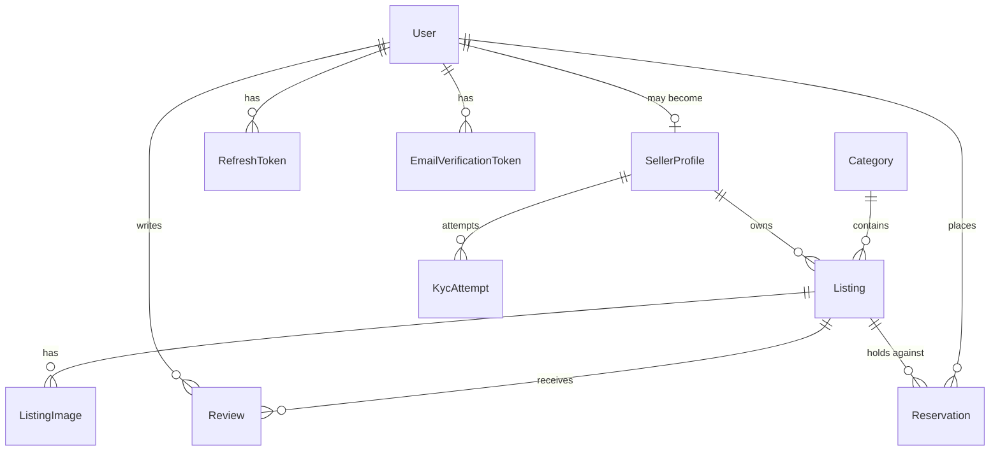

# Data Model

PostgreSQL 16, managed by Prisma 7. Source of truth:
[`backend/prisma/schema.prisma`](../../backend/prisma/schema.prisma).

---

## Entity relationships



## Tables

### `users`

The account. One row per person, whether they buy, sell, or both.

| Column | Type | Notes |
| --- | --- | --- |
| `id` | uuid | PK |
| `email` | text | Unique |
| `passwordHash` | text | bcrypt, cost 12 |
| `name` | text | |
| `isSeller` | bool | Capability flag, not an account type |
| `emailVerified` | bool | Login is blocked until true |
| `avatarUrl` | text? | Public URL of the stored avatar. **The image lives in object storage, never here.** Null falls back to generated initials |
| `createdAt` / `updatedAt` | timestamp | |

### `refresh_tokens`

| Column | Type | Notes |
| --- | --- | --- |
| `id` | uuid | PK |
| `userId` | uuid | FK → users, cascade |
| `tokenHash` | text | Unique. **SHA-256 of the token** — the plaintext is never stored |
| `expiresAt` | timestamp | 30 days from issue |
| `revokedAt` | timestamp? | Set on logout or on reuse detection |
| `replacedByTokenHash` | text? | Rotation chain; presenting a replaced token means it leaked |

### `email_verification_tokens`

| Column | Type | Notes |
| --- | --- | --- |
| `tokenHash` | text | Unique, hashed like refresh tokens |
| `expiresAt` | timestamp | 24 hours |
| `usedAt` | timestamp? | Enforces single use |

### `seller_profiles`

One-to-one with `users`, created when someone starts selling. Separate from
`users` so verification and payout state don't bloat the row read on every
authenticated request.

| Column | Type | Notes |
| --- | --- | --- |
| `userId` | uuid | Unique FK → users, cascade |
| `shopName` | text | Defaults to the user's name |
| `bio` | text? | |
| `kycStatus` | enum | `UNSTARTED` / `PENDING` / `VERIFIED` / `REJECTED` |
| `kycProvider` | text? | e.g. `stub`, `stripe_identity` |
| `kycSessionId` | text? | Provider's session reference for the latest attempt |
| `kycDocType` | text? | `passport` / `drivers_license` / `national_id` |
| `kycCountry` | text? | ISO 3166-1 alpha-2 |
| `kycVerifiedAt` | timestamp? | |
| `kycRejectionReason` | text? | Cleared on success |
| `payoutsEnabled` | bool | True only alongside a `VERIFIED` decision |

**No document data is stored here.** No image, no document number, no date of
birth. Only a reference to the provider's decision.
→ [ADR 0006](../adr/0006-kyc-store-reference-not-document.md)

### `kyc_attempts`

Audit trail. `seller_profiles` holds current state; this holds history.

| Column | Type | Notes |
| --- | --- | --- |
| `sellerProfileId` | uuid | FK, cascade, indexed |
| `provider` | text | |
| `providerSessionId` | text | Unique — the match key for a decision |
| `status` | enum | `PENDING` → `VERIFIED` \| `REJECTED` |
| `documentType` / `country` | text? | Non-sensitive descriptors only |
| `rejectionReason` | text? | |
| `createdAt` / `completedAt` | timestamp | |

### `categories`

| Column | Type | Notes |
| --- | --- | --- |
| `slug` | text | Unique; the public URL segment |
| `title` / `description` | text | |
| `coverImage` | text | |
| `position` | int | Display order |

### `listings`

| Column | Type | Notes |
| --- | --- | --- |
| `id` | uuid | PK |
| `slug` | text | Unique. Generated at creation and **never regenerated**, so links survive renames |
| `sellerId` | uuid | FK → seller_profiles, cascade, indexed |
| `categoryId` | uuid | FK → categories, indexed |
| `title` / `description` | text | |
| `condition` | enum | `LIKE_NEW` / `GOOD` / `WELL_LOVED` / `NEEDS_REPAIR` — drives filtering |
| `conditionNote` | text? | Seller's own wording — what the card shows |
| `priceCents` | int | **Integer minor units.** Never a float |
| `originalPriceCents` | int? | Must exceed `priceCents` if set |
| `currency` | text | ISO 4217, default `USD` |
| `quantity` | int | Default 1 — most secondhand goods are unique |
| `status` | enum | See the [lifecycle](lld.md#4-listing-lifecycle) |
| `featured` | bool | Hand-curation for the "Picked for you" shelf. Not personalisation |
| `deletedAt` | timestamp? | Soft delete |

Indexed on `categoryId`, `sellerId`, `status`, `createdAt`, `featured` — the
five columns the catalog filters and sorts on.

### `listing_images`

| Column | Type | Notes |
| --- | --- | --- |
| `listingId` | uuid | FK, cascade, indexed |
| `url` | text | Public URL of the processed WebP |
| `alt` | text? | Defaults to the listing title |
| `position` | int | **0 is the cover** |

Rows only ever reference images that have been re-encoded and stripped of
metadata; originals are never persisted.

### `reviews`

| Column | Type | Notes |
| --- | --- | --- |
| `listingId` | uuid | FK, cascade, indexed |
| `authorId` | uuid | FK → users, cascade |
| `rating` | int | 1–5 whole stars |
| `body` | text? | |

`@@unique([listingId, authorId])` — one review per person per listing.

**There is no stored aggregate.** Averages are computed from these rows, so a
displayed rating always corresponds to reviews that exist.
→ [ADR 0009](../adr/0009-computed-ratings.md)

### `reservations`

A time-limited hold on stock, taken before checkout. Only `HELD` rows consume
availability.

| Column | Type | Notes |
| --- | --- | --- |
| `listingId` | uuid | FK, cascade, indexed |
| `userId` | uuid | FK → users, cascade |
| `quantity` | int | How much stock this hold consumes |
| `status` | enum | `HELD` → `RELEASED` \| `CONVERTED` \| `EXPIRED` |
| `expiresAt` | timestamp | 15 minutes from creation, indexed |
| `releasedAt` | timestamp? | Set when released or expired |

A **partial unique index** — `("listingId","userId") WHERE status = 'HELD'` —
enforces one live hold per buyer per listing. It is hand-written in the migration
because Prisma cannot express partial indexes, and a plain `@@unique` would also
constrain `RELEASED` rows and stop a buyer re-reserving something they let go.

Availability is decided under a `SELECT … FOR UPDATE` lock on the listing row, so
two buyers can never both claim the same unique item.
→ [ADR 0012](../adr/0012-row-locking-for-reservations.md)

### `wishlist_items`

A saved listing. Deliberately the **opposite** of a reservation: no quantity, no
expiry, and no effect whatsoever on availability. Two people can save the same
one-of-a-kind chair and neither has claimed anything.

| Column | Type | Notes |
| --- | --- | --- |
| `userId` | uuid | FK → users, cascade |
| `listingId` | uuid | FK → listings, cascade |

`@@unique([userId, listingId])` makes saving idempotent. A double-tapped heart,
or the same listing open in two tabs, cannot produce two rows — the app relies
on the index rather than checking first and inserting after, which is the same
read-then-write race as ADR 0012.

### `addresses`

Where orders get delivered. **Soft-deleted, and never referenced by an order.**

| Column | Type | Notes |
| --- | --- | --- |
| `userId` | uuid | FK → users, cascade |
| `fullName`, `line1`, `line2?`, `city`, `region?`, `postcode` | text | Loose by design |
| `country` | text | ISO 3166-1 alpha-2 |
| `phone` | text? | For the courier |
| `isDefault` | bool | At most one live row per user |
| `deletedAt` | timestamp? | Soft delete |

Only `country` is validated strictly. Address formats differ enough between
countries that structured rules reject more real addresses than they catch bad
ones — a UK postcode, an Irish Eircode, and a Hong Kong address with no postcode
are all legitimate.

"At most one default" is enforced **in a transaction**, not by a constraint:
Prisma cannot express a partial unique index on
`isDefault = true AND deletedAt IS NULL`.

### `orders`

| Column | Type | Notes |
| --- | --- | --- |
| `reference` | text | Unique, human-facing (`KIN-XXXXXX`), no O/0 or I/1 |
| `buyerId` | uuid | FK → users, cascade |
| `status` | enum | Payment state only |
| `subtotalCents` | int | Integer minor units |
| `paymentIntentId` | text? | **Unique** — one payment per order |
| `shipTo*` | text? | Eight columns: a **snapshot**, not a relation |

The `shipTo*` columns are copied from an `Address` at checkout. A foreign key
would let last year's parcel silently move house when the buyer edits their
address book, and would break outright if they deleted it.

`paymentIntentId` being unique is what the double-charge defence rests on, and
is why a basket is **not** split into one order per seller.

### `order_items`

| Column | Type | Notes |
| --- | --- | --- |
| `orderId` | uuid | FK, cascade |
| `listingId` | uuid? | SetNull — an order outlives a deleted listing |
| `sellerId` | uuid? | SetNull → seller_profiles |
| `title`, `unitPriceCents`, `sellerName` | — | Snapshots at purchase |
| `fulfilment` | enum | Per line, not per order |
| `shippedAt`, `deliveredAt`, `carrier`, `trackingNumber`, `fulfilmentNote` | — | |

`sellerId` is the field that makes a seller sales view possible at all. Lines
previously carried only `sellerName` — a display string, not something to query
by — which is why sellers could not see their own orders.

Fulfilment lives here rather than on `orders` because a basket can span several
sellers, and two sellers cannot share one parcel. "Your order has shipped" is
not something that can honestly be said about a whole order.

---

## Enums

| Enum | Values |
| --- | --- |
| `ListingStatus` | `DRAFT`, `ACTIVE`, `RESERVED`, `SOLD`, `REMOVED` |
| `Condition` | `LIKE_NEW`, `GOOD`, `WELL_LOVED`, `NEEDS_REPAIR` |
| `VerificationStatus` | `UNSTARTED`, `PENDING`, `VERIFIED`, `REJECTED` |
| `ReservationStatus` | `HELD`, `RELEASED`, `CONVERTED`, `EXPIRED` |
| `OrderStatus` | `PENDING_PAYMENT`, `PROCESSING`, `PAID`, `FAILED`, `CANCELLED`, `REFUNDED` |
| `FulfilmentStatus` | `UNFULFILLED`, `SHIPPED`, `DELIVERED`, `UNFULFILLABLE` |

`OrderStatus` and `FulfilmentStatus` are deliberately separate. Payment and
delivery are independent facts — an order is `PAID` *and* `UNFULFILLED` for as
long as it takes a seller to reach a post office, and one enum cannot hold both.
`PROCESSING` is the mutual-exclusion state that prevents double charging.

## Invariants

Enforced in the application layer unless noted:

1. A visible listing satisfies `status = ACTIVE AND deletedAt IS NULL`.
2. `payoutsEnabled = true` only alongside `kycStatus = VERIFIED`, written in one
   transaction.
3. `isSeller = true` iff a `SellerProfile` exists — both written in one
   transaction by `POST /auth/become-seller`.
4. A published listing has at least one `ListingImage`.
5. `originalPriceCents > priceCents` when set.
6. One review per `(listing, author)` — enforced by the database.
7. A listing's `slug` never changes after creation.
8. `Listing.quantity` never goes negative — enforced by deciding availability
   under a row lock, not by a check constraint.
9. At most one `HELD` reservation per (listing, buyer) — enforced by the
   database.
10. One payment per order — `paymentIntentId` is unique, enforced by the
    database. This is what makes splitting a basket across orders impossible
    without breaking the double-charge defence.
11. An order's `shipTo*` is immutable once written. Editing or deleting the
    `Address` it came from must never change it.
12. One wishlist row per (user, listing) — enforced by the database.
13. `payoutsEnabled` and a `VERIFIED` decision are written in the same
    transaction, so payouts can never be enabled without a recorded decision
    beside them.
14. A review requires a `PAID` order containing that listing, and a seller can
    never review their own — checked in that order, so a seller is told they own
    it rather than being sent off to buy it.
15. Fulfilment only advances `UNFULFILLED → SHIPPED → DELIVERED`, and only on
    `PAID` orders. `DELIVERED` is set by the **buyer**, never the seller.
16. **`Order.refundedCents` never exceeds `subtotalCents`** — enforced by the
    conditional UPDATE that reserves headroom before any refund is issued, not
    by a check constraint, because the guard has to run *before* the provider
    call rather than reject the write afterwards.
17. The sum of a refund's `SUCCEEDED` and `PENDING` rows equals its order's
    `refundedCents`. `FAILED` rows are excluded and their headroom released, so
    a refused refund leaves no phantom reservation behind.
18. `Order.status = REFUNDED` iff `refundedCents >= subtotalCents`. A partly
    refunded order stays `PAID`, which is why there is no
    `PARTIALLY_REFUNDED` state to keep in step.
19. At most one `SUCCEEDED` or `PENDING` refund per `orderItemId` for the
    automatic path, so a seller re-marking a line cannot refund it twice.
20. A `Refund` row is append-only apart from `status` moving off `PENDING`, and
    `providerRefundId` is unique — which is what makes webhook redelivery
    idempotent.

## Migrations

| Migration | Adds |
| --- | --- |
| `init` | `users` |
| `add_refresh_tokens` | `refresh_tokens` |
| `add_email_verification` | `email_verification_tokens`, `emailVerified` |
| `add_catalog_and_seller_profiles` | `seller_profiles`, `categories`, `listings`, `listing_images`, `reviews`, all three enums |
| `add_featured_flag` | `listings.featured` |
| `add_kyc_attempts` | `kyc_attempts` |
| `add_user_avatar` | `users.avatarUrl` |
| `add_reservations` | `reservations`, `ReservationStatus`, partial unique index |
| … | *(orders, wishlist, addresses, notifications, moderation, admin TOTP)* |
| `add_totp_replay_protection` | `users.totpLastUsedAt` |
| `add_refunds` | `refunds`, `RefundStatus`, `RefundTrigger`, `orders.refundedCents`, `NotificationType.REFUND_ISSUED` |

```bash
npx prisma migrate dev --name <name>   # create + apply
npx prisma generate                    # regenerate client (not always automatic)
npx prisma studio                      # browse data
```

> `migrate dev` does not reliably regenerate the client in this setup. If a new
> column or enum is missing from types at runtime, run `prisma generate`.

## Seed

`npx prisma db seed` → 5 categories, 13 listings, 46 reviews, 12 reviewer
accounts, and one house seller ("Kintsugi Collection") that owns the seeded
inventory so `sellerId` can stay non-nullable.

Every write is an upsert keyed on a unique column, so re-running converges
instead of duplicating.

Seed accounts get a random password that is never recorded, leaving them
effectively login-disabled rather than sharing a known weak credential.
Listing `createdAt` values are backdated so "Recently listed" is a genuine date
sort.
