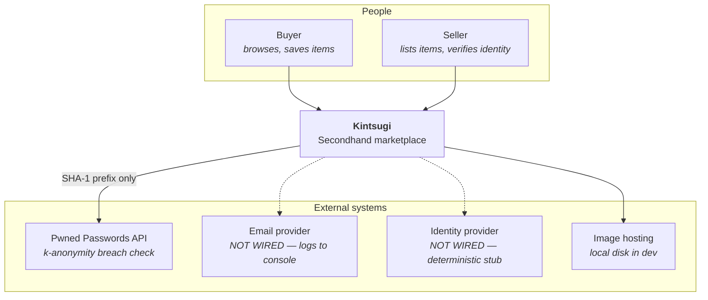
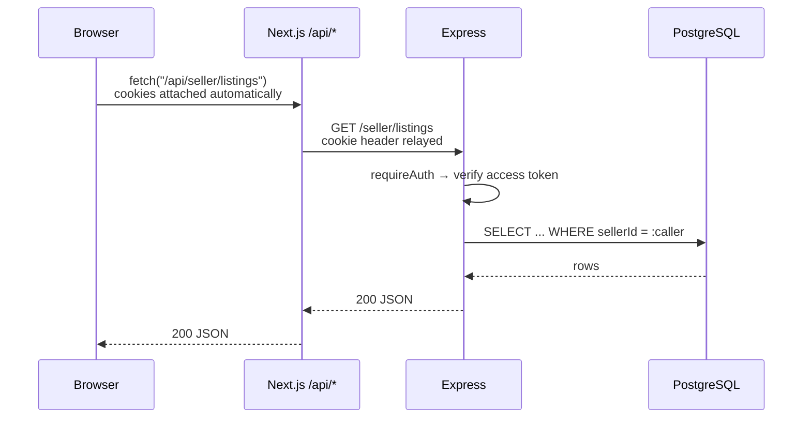
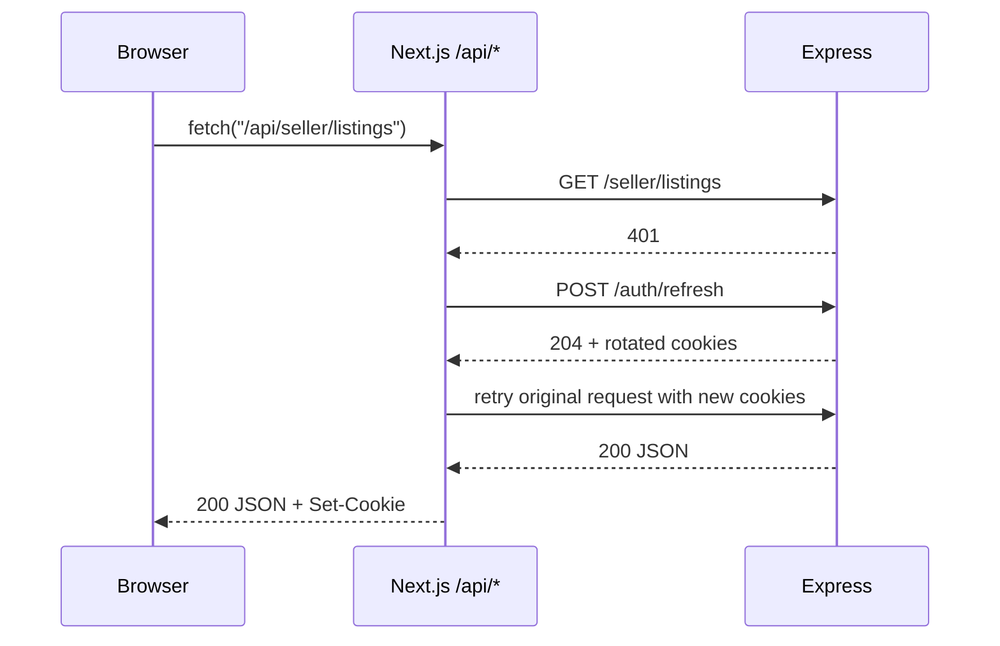
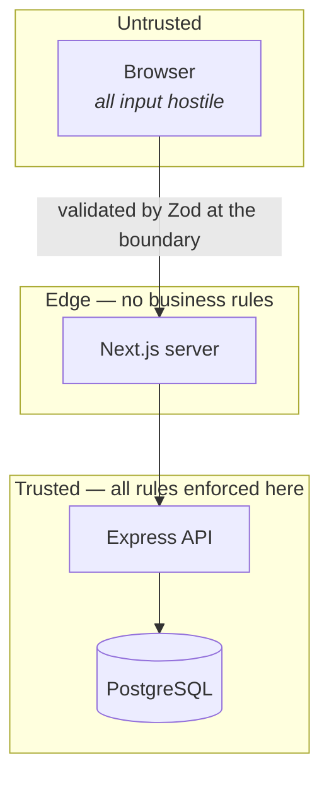

# High-Level Design

Scope: the whole system, its containers, and the cross-cutting concerns that
apply everywhere. For per-module detail see [lld.md](lld.md).

---

## 1. System context

Dotted lines are seams with stub implementations. They are real interfaces with
fake bodies, not missing code — see
[§6 Deliberate stubs](#6-deliberate-stubs).

## 2. Containers

| Container | Runtime | Responsibility |
| --- | --- | --- |
| **Storefront + BFF** | Next.js 16, Node | Renders the UI; proxies all browser API traffic to Express |
| **API** | Express 4, Node | Business rules, persistence, authorisation, image processing |
| **Database** | PostgreSQL 16 | System of record |
| **Image store** | Disk (dev) | Processed seller photos, served over HTTP |

Two Node processes, deliberately. The Next.js server holds no business logic —
it renders and forwards. Every rule is enforced in Express, so a client that
bypasses the UI gains nothing.

### Where rendering happens

| Route | Mode | Why |
| --- | --- | --- |
| `/`, `/search`, `/shop/[category]`, `/listing/[slug]` | Server-rendered per request | Inventory changes; must not be stale |
| `/seller/*`, `/account`, `/cart`, `/wishlist` | Client components | Need client auth state and interactivity |
| `/api/*` | Route handlers | The BFF |

Public catalog pages are fetched in server components that call Express
**directly**, not through `/api/*`. The Next server *is* the BFF, so routing a
server-side read through its own HTTP handler would add a hop for nothing. The
BFF exists for *browser* traffic.

## 3. Request lifecycle

A browser-initiated, authenticated call:

When the access token has expired:

The retry is invisible to the caller. Endpoints that legitimately return 401 —
`/auth/login`, `/auth/signup`, `/auth/refresh`, `/auth/verify-email`,
`/auth/resend-verification` — are excluded, otherwise a wrong password would
trigger a refresh loop.

## 4. Security model

### Session handling

| Token | Form | Lifetime | Storage |
| --- | --- | --- | --- |
| Access | Signed JWT | 15 minutes | `httpOnly` cookie |
| Refresh | Opaque random string | 30 days | `httpOnly` cookie; **SHA-256 hash** in DB |

Cookies are `httpOnly`, `sameSite=lax`, and `secure` in production. No token is
readable by JavaScript, so XSS cannot exfiltrate a session.

Refresh tokens are stored hashed. A database leak yields hashes, not usable
sessions — the same reasoning as password hashing, applied to a credential
that is equally sufficient to impersonate someone.

**Rotation with reuse detection.** Each refresh issues a new token and marks
the old one replaced. Presenting an already-rotated token means it leaked, so
the whole family is revoked and the session dies. The legitimate user logs in
again; the attacker gains nothing lasting.

### Passwords

A 12-character minimum plus a breach check against Pwned Passwords, instead of
composition rules. `P@ssw0rd1` satisfies every "one upper, one digit, one
symbol" policy and is also in every breach corpus. Length and
known-compromise are the properties that correlate with real resistance.

The check sends the **first five characters of the SHA-1 hash** and filters the
returned range locally, so the password is never transmitted. The check fails
open: if the API is unreachable, signup proceeds rather than blocking
registration on a third party.
→ [ADR 0004](../adr/0004-password-policy.md)

### Authorisation

Authentication establishes *who*; it never establishes *what they may touch*.
Two middlewares compose:

- `requireAuth` — validates the access token, sets `req.userId`
- `requireSeller` — resolves the caller's `SellerProfile`, sets `req.sellerId`

Every seller query is then scoped by `sellerId`. A listing belonging to someone
else returns **404, not 403**: a 403 confirms the id exists and would let
someone enumerate other sellers' inventory.

### Uploads

Untrusted bytes get three treatments before storage:

1. **Magic-byte sniffing** — the header is inspected. Filename extensions and
   client `Content-Type` are attacker-controlled and prove nothing.
2. **Re-encode via Sharp** — output is a fresh WebP. Sharp does not copy
   metadata unless asked, which strips EXIF *including GPS*. Sellers photograph
   items inside their homes; publishing that metadata would leak home
   addresses. `.rotate()` runs first so orientation survives.
3. **Bounds** — 8 MB per file, 8 images per listing, 2000 px longest edge,
   a 50-megapixel decode cap against decompression bombs, and 30 uploads per
   user per hour.

### Identity data

No government ID is ever stored: no image, no document number, no date of
birth. Those values pass through memory and are discarded. What persists is a
provider session id, document *type*, issuing country, outcome, and timestamp.

Holding ID documents would make the database a high-value breach target and
pull it under special-category data rules (GDPR Art. 9-adjacent; India's DPDP
Act treats them similarly) for no product benefit.
→ [ADR 0006](../adr/0006-kyc-store-reference-not-document.md)

### Trust boundaries

Because the BFF forwards without interpreting, it is not a security control.
Nothing is enforced only in Next.js or only in the UI. Disabled buttons are a
courtesy; the server re-checks. Publishing without a photo is rejected by the
API even though the button is greyed out.

## 5. Cross-cutting concerns

**Validation.** Zod parses every request body and query string at the route
boundary. Errors carry a machine-readable `code` and, where applicable, the
offending `field`, which the UI attaches to the specific input.

**Money.** Integer minor units (`priceCents`) everywhere. Write endpoints
accept cents so no float rounding is possible in transit; the search API accepts
whole currency units because that is what a price filter collects.
→ [ADR 0005](../adr/0005-money-as-integer-minor-units.md)

**Deletion.** Listings soft-delete (`deletedAt` + `status = REMOVED`). A
listing referenced by a past order must stay resolvable. All catalog reads
filter on `deletedAt: null` and `status: ACTIVE`.
→ [ADR 0008](../adr/0008-soft-delete-and-listing-status.md)

**Public URLs.** A listing's `slug` is generated once at creation and never
regenerated when the title changes, so existing links keep working.

**Errors.** Every route wraps its handler; failures log server-side with
context and return a generic message. Internal details are not sent to clients.

## 6. Deliberate stubs

Three integrations are interfaces with fake implementations. Each is a single
module, chosen so that going live means editing one file.

| Concern | Module | Stub behaviour | Production path |
| --- | --- | --- | --- |
| Email | `lib/mailer.ts` | Logs the verification link | Resend, SES, Postmark |
| File storage | `lib/storage.ts` | Writes to local disk | S3, R2, Cloudinary |
| Identity | `lib/kycProvider.ts` | Deterministic outcomes by document-number suffix | Stripe Identity, Persona, Onfido |

`lib/kycProvider.ts` mirrors Stripe Identity's shape deliberately —
`startSession()` ≈ `verificationSessions.create()`, `decide()` ≈ the webhook
that follows — so the swap is mechanical rather than a redesign.

The API reports `isStub: true` and the UI says so on screen. A stub that
silently looks real is worse than no stub.

## 7. Known limitations

- **No checkout.** Consequently `ListingStatus.RESERVED` and
  `payoutsEnabled` exist but nothing consumes them yet.
- **Concurrency for unique items is unsolved.** Most stock is quantity 1, so
  the hard problem is two buyers claiming one chair. `RESERVED` is the intended
  mechanism; the transaction boundary arrives with checkout.
- **Rate limiting is in-process.** Correct for one instance; replicas would each
  get their own allowance. Needs a shared store (Redis) before scaling out.
- **Search is substring matching** (`ILIKE`). Fine at this size; a Postgres
  `tsvector` index with ranking is the upgrade path.
- **Pagination is offset-based.** Simple and right for numbered result pages;
  deep offsets degrade.
- **Local disk storage does not survive a container restart.** This is why the
  storage seam exists.
- **Aggregate ratings are computed per request.** One extra grouped query per
  page. Denormalising onto `Listing` is the optimisation, at the cost of
  keeping it consistent.
- **No automated test suite.** See [CONTRIBUTING.md](../../CONTRIBUTING.md#testing).
