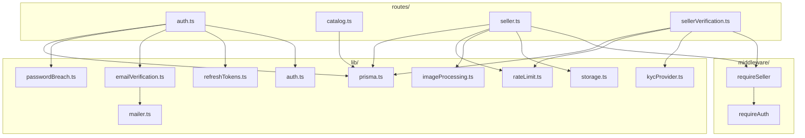
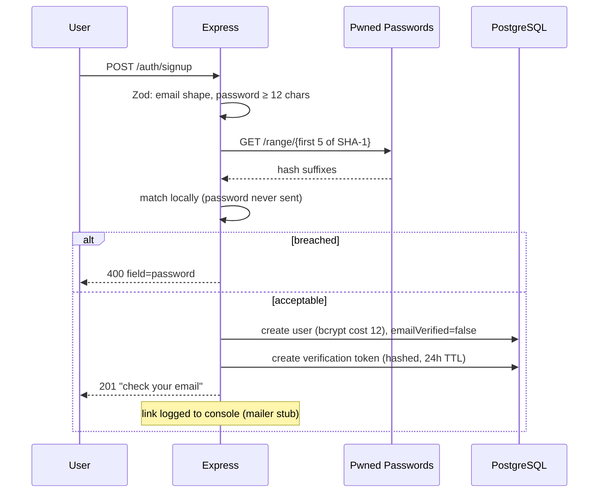
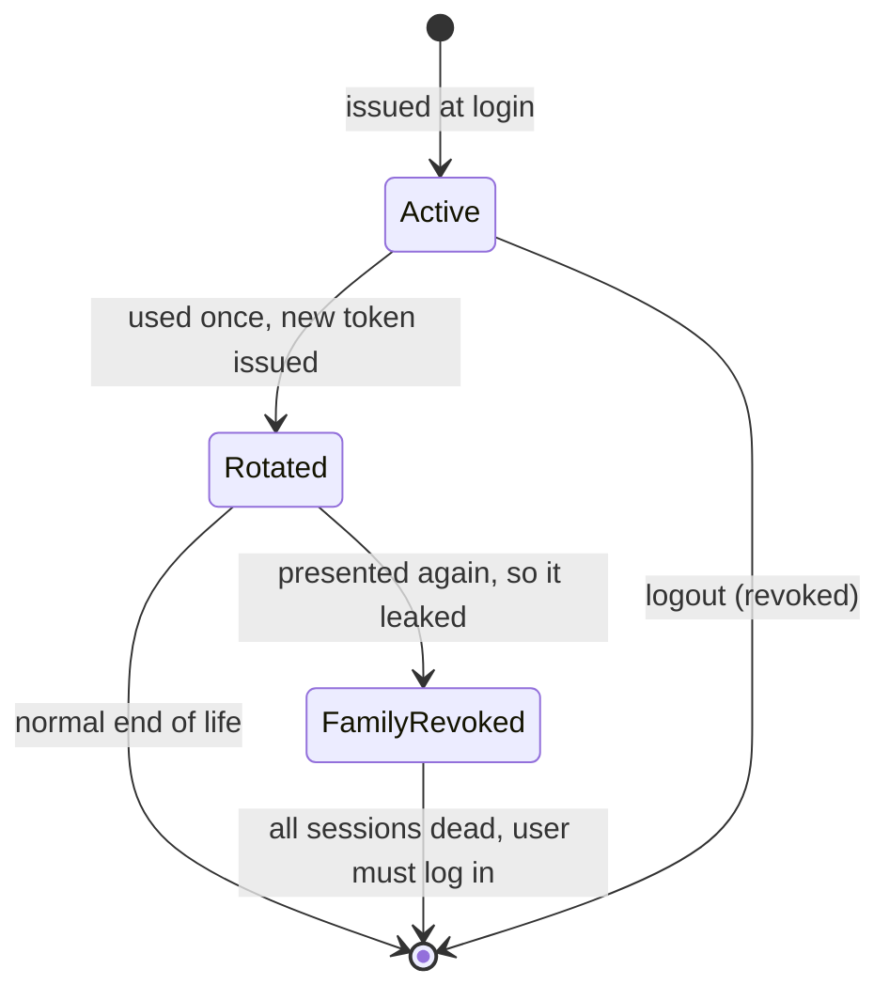
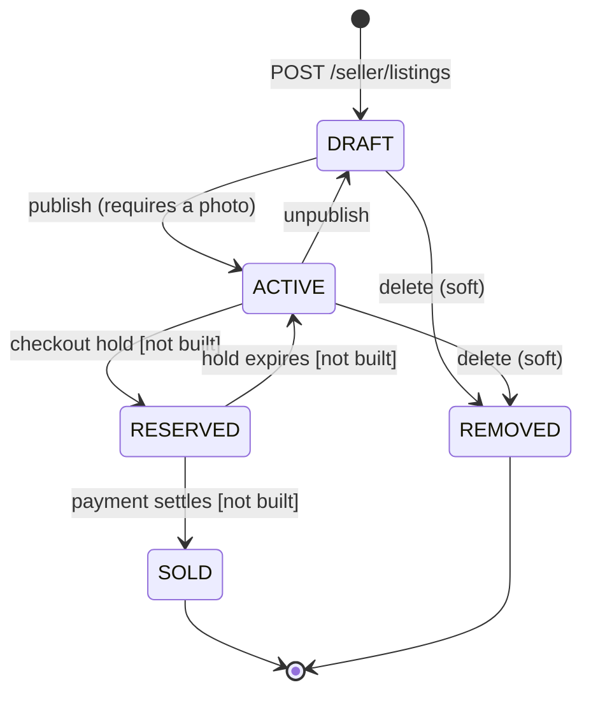
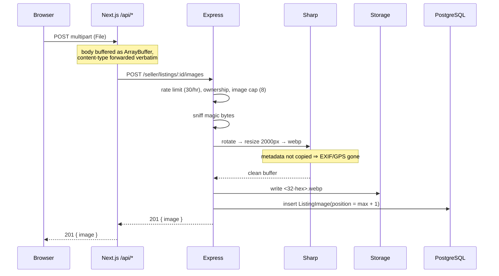
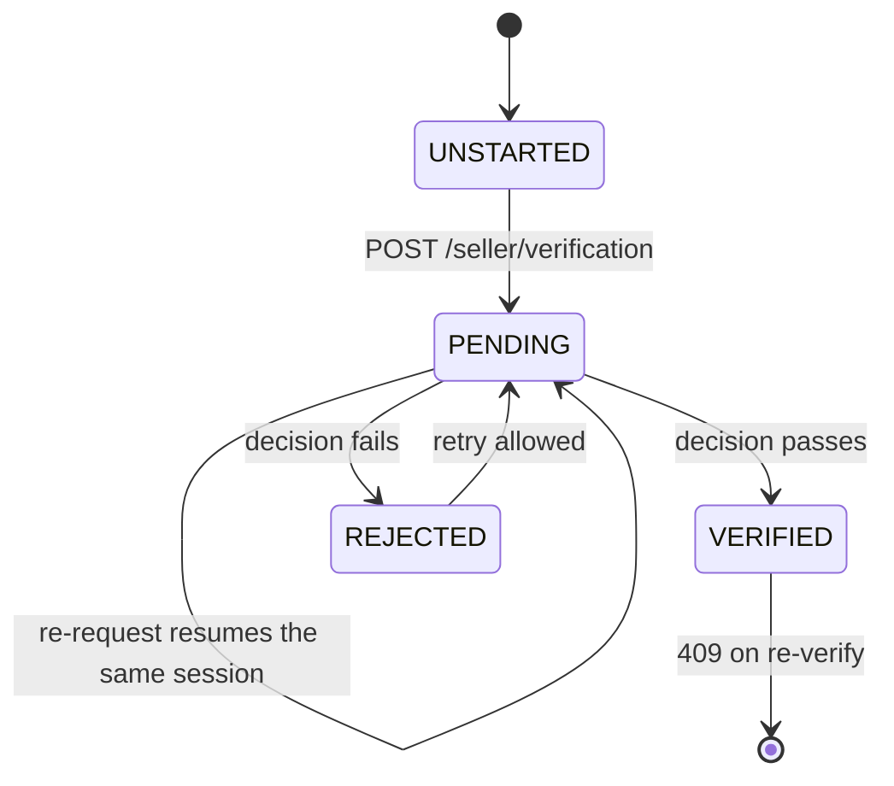

# Low-Level Design

Module-by-module detail and walkthroughs of the flows where the logic is not
obvious from the signatures. For the system view see [hld.md](hld.md).

---

## 1. Backend components



### `lib/` reference

| Module | Responsibility | Notes |
| --- | --- | --- |
| `prisma.ts` | Client singleton | Cached on `globalThis` in dev so hot reload doesn't leak connections |
| `auth.ts` | Hashing, JWT sign/verify, cookie helpers | bcrypt cost 12; access TTL 15 min |
| `refreshTokens.ts` | Issue, rotate, revoke | Reuse detection lives here |
| `emailVerification.ts` | Issue and consume magic-link tokens | Token hashed; single-use via `usedAt` |
| `mailer.ts` | Send verification email | **Stub** — logs to console |
| `passwordBreach.ts` | Pwned Passwords k-anonymity check | Fails open |
| `storage.ts` | Put/remove files, derive public URLs | **Storage seam**; keys validated against a strict pattern |
| `imageProcessing.ts` | Validate and re-encode uploads | Magic bytes, EXIF stripping, bounds |
| `kycProvider.ts` | Start session, apply decision | **Stub**; shaped like Stripe Identity |
| `rateLimit.ts` | Fixed-window counter | In-process; needs Redis to scale out |

### Frontend modules

| Module | Responsibility |
| --- | --- |
| `lib/backendProxy.ts` | The BFF. Buffers the body, relays cookies, transparent refresh-and-retry |
| `lib/api.ts` | Auth API client; `ApiError` carries `code` and `field` |
| `lib/sellerApi.ts` | Seller and verification client; dollar↔cent conversion |
| `lib/catalog.ts` | **Server-side** catalog fetches, price formatting, filter option lists |
| `lib/AuthContext.tsx` | Client auth state (`user`, `loading`, and the auth actions) |
| `lib/useDismissable.ts` | Shared click-outside + Escape behaviour for dropdowns |

`catalog.ts` is server-only and calls Express directly. `api.ts` and
`sellerApi.ts` are browser-side and go through `/api/*`. Keeping them separate
keeps the trust boundary legible.

---

## 2. Authentication flows

### Signup and verification



Login is **hard-blocked** until verified — unverified accounts get no session
at all, rather than a limited one. Signing up again on an unverified email
re-sends the link and **updates the password hash**, so a user who mistyped
their password the first time is not locked into the old one.

### Refresh rotation and reuse detection



A rotated token being presented a second time can only mean two parties hold
it. There is no way to tell which is the attacker, so the safe move is to end
the session for both. The real user re-authenticates; a stolen token becomes
worthless.

---

## 3. Catalog queries

`GET /catalog/listings` composes a Prisma `where` from optional filters:

```
VISIBLE                      status = ACTIVE AND deletedAt IS NULL   (always)
category                     → category.slug
condition                    → enum equality
minPrice / maxPrice          → priceCents gte/lte  (dollars × 100)
q                            → title ILIKE OR description ILIKE
featured                     → boolean
```

Three details worth knowing:

**Empty strings are dropped before parsing.** The filter form submits unset
fields as `""`. Rejecting the whole request for that would be hostile, so blank
values are stripped and treated as absent.

**Sorts carry a tiebreaker.** Every `orderBy` ends with `id: "asc"`. Without
it, rows with equal prices can shuffle between pages and an item may appear
twice or never.

**Ratings come from one grouped query.** Rather than N+1 per card:

```ts
prisma.review.groupBy({
  by: ["listingId"],
  where: { listingId: { in: pageIds } },
  _avg: { rating: true },
  _count: { rating: true },
})
```

A listing with no reviews returns `{ average: null, count: 0 }`, and the UI
renders "No reviews yet" rather than a fabricated zero.

### Serialised listing shape

```ts
{
  id, slug, title, description,
  condition,          // enum — drives filtering
  conditionNote,      // seller's own wording — what the card displays
  priceCents, originalPriceCents, currency,
  quantity, featured, createdAt,
  category: { slug, title },
  seller:   { shopName, verified },   // derived; exposes no verification detail
  images:   [{ url, alt, position }], // position 0 is the cover
  rating:   { average, count },
}
```

`condition` and `conditionNote` are split on purpose. The enum makes filtering
possible; the free-text note preserves phrasing like "Needs a tune-up" that a
fixed vocabulary would flatten.

---

## 4. Listing lifecycle



Everything starts as a private `DRAFT`; nothing reaches buyers until published,
and publishing requires a photo. `SOLD` is terminal for editing — a sold
listing cannot be modified or unpublished, because it is now a record of a
transaction.

Publishing is **not** gated on identity verification. Authoring a listing is
harmless; blocking it only costs seller onboarding. Verification gates payouts.
→ [ADR 0007](../adr/0007-verification-gates-payouts.md)

### Ownership scoping

Every `:id` route funnels through one helper:

```ts
prisma.listing.findFirst({
  where: { id, sellerId, deletedAt: null },
})
```

A miss yields 404 regardless of whether the row exists under another seller.
That symmetry is the point: response codes must not disclose the existence of
records the caller cannot access.

---

## 5. Image upload



**Why the BFF buffers as bytes.** It originally read bodies with `.text()`,
which corrupts binary. It now buffers an `ArrayBuffer` and forwards the
incoming `Content-Type` so multipart boundaries survive. Buffering rather than
streaming is deliberate: the refresh-and-retry path must be able to send the
same body twice, and a stream can only be consumed once.

**Storage keys are server-generated** — 16 random bytes, hex, plus extension —
and validated against `/^[a-f0-9]{32}\.[a-z0-9]{2,5}$/` before any filesystem
write or delete. User input never reaches a path, so traversal is impossible by
construction.

**Deleting the last photo of a published listing is refused.** Otherwise a live
listing would show buyers nothing.

---

## 6. Identity verification



`SellerProfile` holds the **current** state; `KycAttempt` records **every**
attempt. Identity decisions have to remain explainable after the fact, and a
rejected seller needs to see why before retrying.

### Applying a decision

The attempt and the permission are written in one transaction:

```ts
await prisma.$transaction([
  prisma.kycAttempt.update({ /* outcome, docType, country, completedAt */ }),
  prisma.sellerProfile.update({ /* kycStatus, payoutsEnabled: verified */ }),
]);
```

`payoutsEnabled` must never end up true without a verified decision recorded
beside it, so the two writes cannot be allowed to diverge.

### What is discarded

`documentNumber` is read, passed to `decide()`, and dropped. It is not
returned, not logged, and not persisted — verified by dumping the profile and
attempt rows after submission and asserting the value is absent.

### Stub decision rules

Deterministic so both branches are testable without anyone's real ID, mirroring
how Stripe and Persona expose fixed sandbox outcomes:

| Document number | Outcome |
| --- | --- |
| ends `0000` | Rejected — document unreadable |
| ends `0001` | Rejected — name mismatch |
| anything else | Verified |

Attempts are capped at 5/hour: the outcome is derived from input, so an
uncapped endpoint would let someone probe for the passing case.

---

## 7. Frontend patterns

**Server fetch, client arrangement.** `app/page.tsx` is a server component that
fetches categories and both shelves in parallel, then hands them to
`HomeSections` (a client component) which only decides which layout to show
based on auth state. Data fetching stays on the server; only the branch needs
the client.

**Field-scoped errors.** `ApiError` carries `field`, so a server-side rejection
renders beneath the specific input rather than as a banner.

**Dollars in, cents out.** Forms collect dollars; `dollarsToCents` converts
before the request. `formatPrice` renders whole amounts without decimals
(`$310`) and fractional ones with (`$64.50`).

**Honest empty states.** Unbuilt features say so and carry a "Planned" badge
instead of showing a control that does nothing. There is no non-functional
"Add to cart" button.

---

## 8. Conventions

- **Validation at the boundary.** Zod at the route; typed values inward.
- **`async` handlers are wrapped.** Express 4 does not catch rejected promises;
  every handler try/catches, logs with context, returns a generic message.
- **Selects are explicit.** Routes name the fields they return, so adding a
  column never leaks it through an existing endpoint.
- **Comments explain *why*.** The non-obvious constraint, not the syntax.
- **Naming.** Tables `snake_case` via `@@map`; TypeScript `camelCase`;
  enums `SCREAMING_SNAKE_CASE`.
