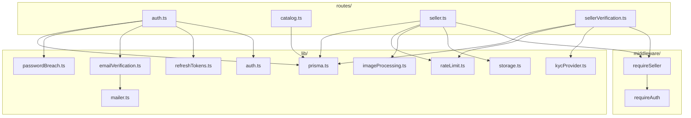
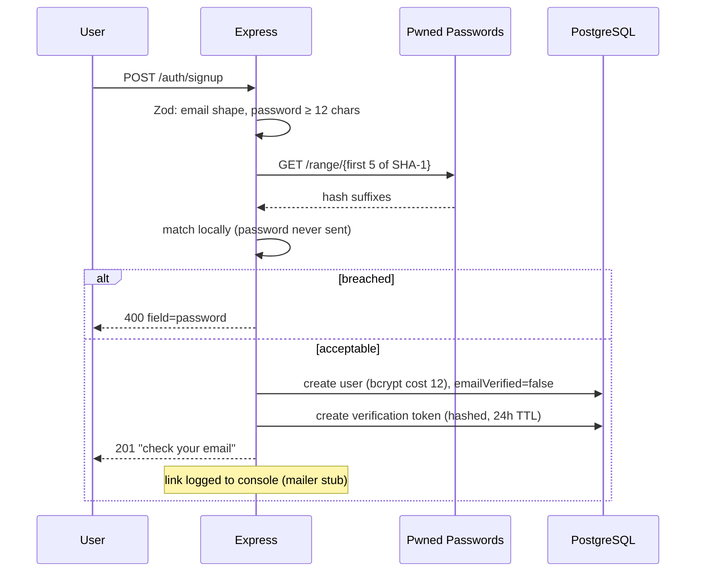
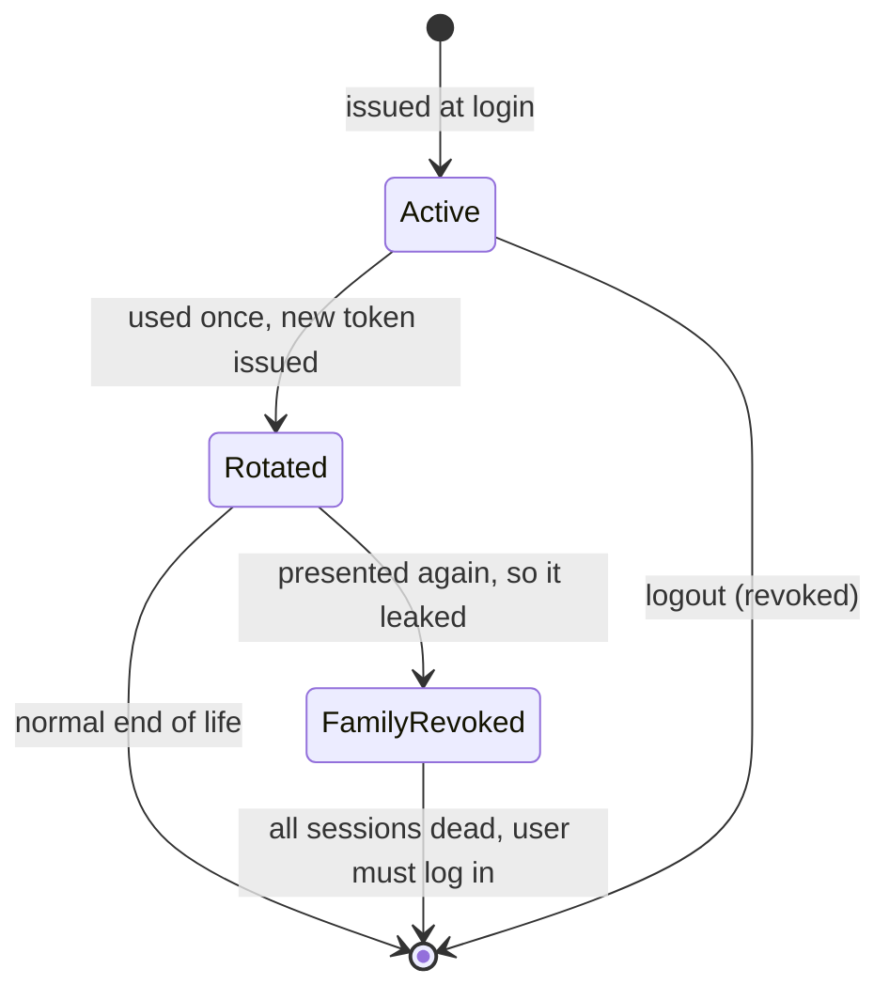
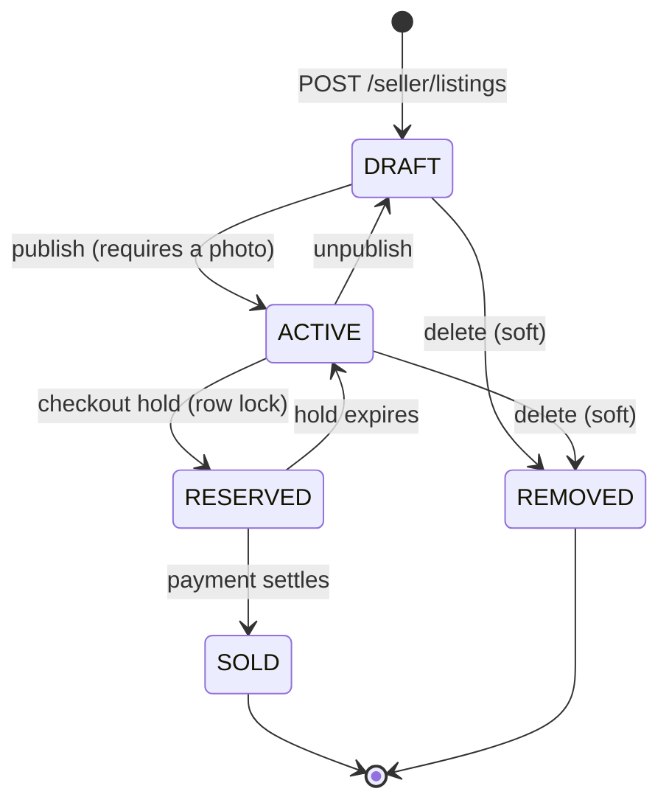
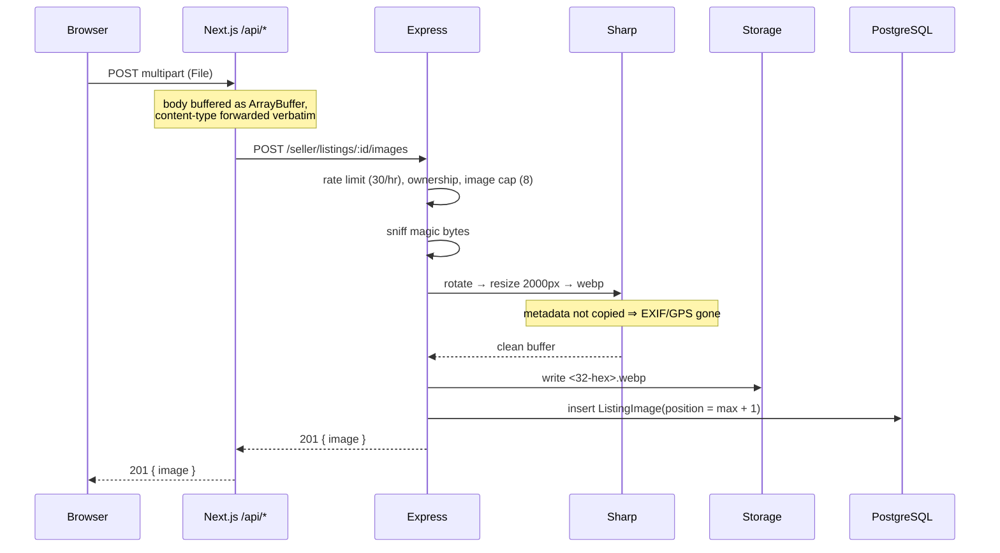
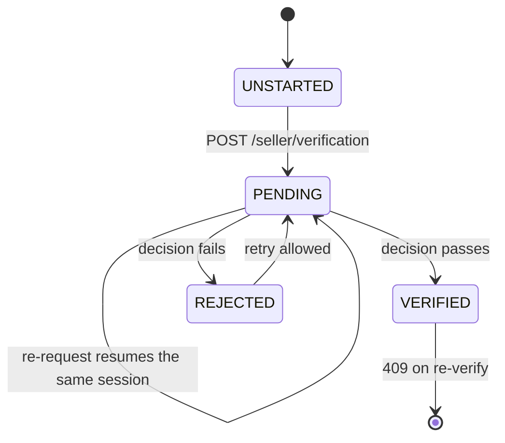
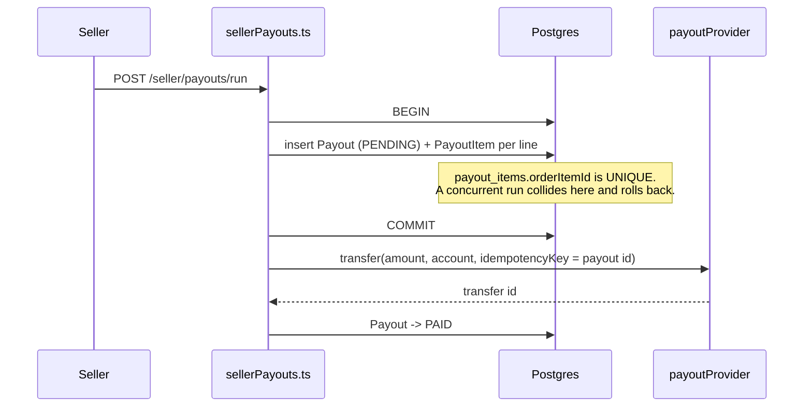
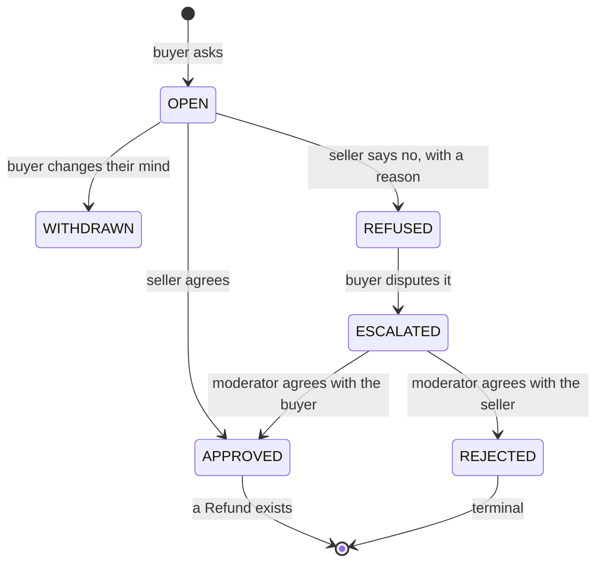

# Low-Level Design

Module-by-module detail and walkthroughs of the flows where the logic is not
obvious from the signatures. For the system view see [hld.md](hld.md).

---

## 1. Backend components



The diagram above is the **signup-to-listing slice only** — it is the oldest part
of the system and the one a reader usually needs first. The buying, moderation
and notification modules are tabulated below rather than drawn here; the
notification pipeline has its own diagram in
[plan 0001](../plans/0001-multi-channel-notifications.md).

### `lib/` reference — foundations

| Module | Responsibility | Notes |
| --- | --- | --- |
| `prisma.ts` | Client singleton | Cached on `globalThis` in dev so hot reload doesn't leak connections |
| `auth.ts` | Hashing, JWT sign/verify, cookie helpers | bcrypt cost 12; access TTL 15 min |
| `refreshTokens.ts` | Issue, rotate, revoke | Reuse detection lives here |
| `emailVerification.ts` | Issue and consume magic-link tokens | Token hashed; single-use via `usedAt` |
| `mailer.ts` | Send transactional mail | Three transports: console, Ethereal, real SMTP |
| `passwordBreach.ts` | Pwned Passwords k-anonymity check | Fails open |
| `storage.ts` | Put/remove objects, derive public URLs | Two drivers — local disk or S3-compatible — behind one interface. Keys validated against a strict pattern, and shared by both so a driver change cannot orphan stored URLs |
| `imageProcessing.ts` | Validate and re-encode uploads | Magic bytes, EXIF stripping, bounds |
| `kycProvider.ts` | Start session, apply decision | Stripe Identity, or a stub behind the same seam |
| `paymentProvider.ts` | Intents, refunds, webhook verification | Stripe, or a stub behind the same seam |
| `refunds.ts` | Issue, settle, cap | Over-refund guard is an atomic conditional UPDATE |
| `rateLimit.ts` | Fixed-window counter | Redis + Lua, shared across instances |
| `cache.ts` | Read-through cache | Cache-aside, fail-open, stale-while-revalidate |
| `cacheKeys.ts` | Every cache key and TTL | One file, so invalidation is discoverable |

### `lib/` reference — buying and selling

| Module | Responsibility |
| --- | --- |
| `reservations.ts` | Holds stock during checkout under `SELECT … FOR UPDATE`, and the sweeper that releases expired holds ([ADR 0012](../adr/0012-row-locking-for-reservations.md)) |
| `cart.ts` | Basket assembly and pricing, read from live listings |
| `orders.ts` | Order creation, the claim-then-charge sequence, and the sweeper that settles in-flight payments |
| `sales.ts` | The seller's side: shipped, delivered, unfulfillable — per line, not per order |
| `addresses.ts` | Address CRUD, and the snapshot copied onto an order so later edits cannot rewrite history |
| `wishlist.ts` | Saved items |
| `stripeClient.ts` | The shared Stripe client. Separate from `paymentProvider.ts` because payments and identity are independently configurable |
| `verification.ts` | Applies an identity decision to a seller profile; sets `payoutsEnabled` |
| `payoutProvider.ts` | The Connect seam: `createAccount`, `onboardingLink`, `accountStatus`, `transfer`, `reverseTransfer`. Stub and `stripe_connect` ([ADR 0029](../adr/0029-payouts-separate-transfers-not-destination-charges.md)) |
| `payouts.ts` | What a seller is owed and the claim that pays it: `payableItems`, `earningsSummary`, `claimPayout`, `sendClaimedPayout`, `sendPendingPayouts`, `reverseForRefund` ([ADR 0030](../adr/0030-payout-eligibility-and-hold.md)) |
| `returns.ts` | A buyer asking for money back: `eligibility`, `openReturn` (the insert is the claim), and the state machine `approveReturn` / `refuseReturn` / `escalateReturn` / `withdrawReturn` ([ADR 0031](../adr/0031-buyer-initiated-returns.md)) |

### `lib/` reference — trust and administration

| Module | Responsibility |
| --- | --- |
| `reviews.ts` | Reviews, and ratings computed from rows rather than stored ([ADR 0009](../adr/0009-computed-ratings.md)) |
| `moderation.ts` | Removals, suspensions and report resolution, each writing an append-only audit row |
| `adminAuth.ts` | The separate short-lived admin session and its TOTP step-up ([ADR 0015](../adr/0015-admin-by-cli-grant-and-step-up.md)) |
| `adminStats.ts` | Every read-only query behind the admin panel, including the delivery, payout and return logs |
| `passwordReset.ts` | Reset tokens: hashed, single-use, and no account enumeration ([ADR 0017](../adr/0017-password-change-and-reset.md)) |
| `redis.ts` | Connection singleton shared by the limiter and the cache |

### `lib/` reference — notifications

The pipeline, roughly in the order an event travels. Decisions are
[ADR 0024](../adr/0024-outbox-not-dual-writes.md) through
[ADR 0028](../adr/0028-sms-provider-twilio-behind-a-seam.md).

| Module | Responsibility |
| --- | --- |
| `notifications.ts` | `notify()` / `notifyMany()` — writes the notification **and** its outbox row in one transaction. The eleven call sites only ever touch `events.*` |
| `outbox.ts` | `enqueue(tx, event)`, which takes a transaction client so it cannot be called outside one. Also the event codec |
| `relay.ts` | Claims unpublished rows with `FOR UPDATE SKIP LOCKED` and publishes them. N relays divide the backlog rather than duplicating it |
| `notifyTransport.ts` | The `inline` / `kafka` seam. Under `inline` the relay calls the consumer functions directly — no broker, which is what CI runs |
| `kafka.ts` | Client, topic names, partition counts and retention. The native client is imported lazily so the inline path never loads it |
| `consumers.ts` | The channel consumers as plain async functions, so the same code runs under both transports |
| `channelPolicy.ts` | Which channels each event type uses by default, and how an explicit preference overrides it |
| `deliveryLedger.ts` | Claims a delivery **before** the provider is called; settles it after. The unique constraint is what makes an at-least-once broker safe ([ADR 0026](../adr/0026-delivery-idempotency.md)) |
| `retry.ts` | The 5s / 1m / 15m delay topics and the dead-letter queue. Delays live on separate topics because a consumer that waits blocks its whole partition |
| `stalePending.ts` | Resolves deliveries claimed and never settled, on a per-channel policy: email and push are resent, SMS never is |
| `deferredDeliveries.ts` | Sends what quiet hours parked, once the window opens — claimed by conditional `UPDATE` so N replicas divide the work |
| `outboxRetention.ts` | Prunes published rows after 7 days, matching topic retention. Unpublished rows are never deleted at any age |
| `consumerLag.ts` | Per-group lag, per-topic, plus dead-letter depth — behind `GET /health/lag` |
| `unsubscribe.ts` | Signed unsubscribe tokens and one-click headers |
| `push.ts` | Web Push over VAPID. A `410` or `404` deletes the subscription — the protocol saying the browser is gone |
| `smsProvider.ts` | The Twilio seam, and the table of provider error codes that are permanent rather than transient |
| `smsVerification.ts` | Six-digit codes: hashed, ten-minute expiry, attempt-capped |
| `phone.ts` | E.164 normalisation. Deliberately shape-only — the code is what proves a number is real |
| `quietHours.ts` | The window, and the arithmetic for one that wraps midnight |

### Frontend modules

| Module | Responsibility |
| --- | --- |
| `lib/backendProxy.ts` | The BFF. Buffers the body, relays cookies, transparent refresh-and-retry |
| `lib/api.ts` | Auth API client; `ApiError` carries `code` and `field` |
| `lib/sellerApi.ts` | Seller and verification client; dollar↔cent conversion |
| `lib/catalog.ts` | **Server-side** catalog fetches, price formatting, filter option lists |
| `lib/AuthContext.tsx` | Client auth state (`user`, `loading`, and the auth actions) |
| `lib/useDismissable.ts` | Shared click-outside + Escape behaviour for dropdowns |

`catalog.ts` is server-only and calls Express directly. `api.ts` and
`sellerApi.ts` are browser-side and go through `/api/*`. Keeping them separate
keeps the trust boundary legible.

---

## 2. Authentication flows

### Signup and verification



Login is **hard-blocked** until verified — unverified accounts get no session
at all, rather than a limited one. Signing up again on an unverified email
re-sends the link and **updates the password hash**, so a user who mistyped
their password the first time is not locked into the old one.

### Refresh rotation and reuse detection



A rotated token being presented a second time can only mean two parties hold
it. There is no way to tell which is the attacker, so the safe move is to end
the session for both. The real user re-authenticates; a stolen token becomes
worthless.

---

## 3. Catalog queries

`GET /catalog/listings` composes a Prisma `where` from optional filters:

```
VISIBLE                      status = ACTIVE AND deletedAt IS NULL   (always)
category                     → category.slug
condition                    → enum equality
minPrice / maxPrice          → priceCents gte/lte  (dollars × 100)
q                            → title ILIKE OR description ILIKE
featured                     → boolean
```

Three details worth knowing:

**Empty strings are dropped before parsing.** The filter form submits unset
fields as `""`. Rejecting the whole request for that would be hostile, so blank
values are stripped and treated as absent.

**Sorts carry a tiebreaker.** Every `orderBy` ends with `id: "asc"`. Without
it, rows with equal prices can shuffle between pages and an item may appear
twice or never.

**Ratings come from one grouped query.** Rather than N+1 per card:

```ts
prisma.review.groupBy({
  by: ["listingId"],
  where: { listingId: { in: pageIds } },
  _avg: { rating: true },
  _count: { rating: true },
})
```

A listing with no reviews returns `{ average: null, count: 0 }`, and the UI
renders "No reviews yet" rather than a fabricated zero.

### Serialised listing shape

```ts
{
  id, slug, title, description,
  condition,          // enum — drives filtering
  conditionNote,      // seller's own wording — what the card displays
  priceCents, originalPriceCents, currency,
  quantity, featured, createdAt,
  category: { slug, title },
  seller:   { shopName, verified },   // derived; exposes no verification detail
  images:   [{ url, alt, position }], // position 0 is the cover
  rating:   { average, count },
}
```

`condition` and `conditionNote` are split on purpose. The enum makes filtering
possible; the free-text note preserves phrasing like "Needs a tune-up" that a
fixed vocabulary would flatten.

---

## 4. Listing lifecycle



Everything starts as a private `DRAFT`; nothing reaches buyers until published,
and publishing requires a photo. `SOLD` is terminal for editing — a sold
listing cannot be modified or unpublished, because it is now a record of a
transaction.

Publishing is **not** gated on identity verification. Authoring a listing is
harmless; blocking it only costs seller onboarding. Verification gates payouts.
→ [ADR 0007](../adr/0007-verification-gates-payouts.md)

### Ownership scoping

Every `:id` route funnels through one helper:

```ts
prisma.listing.findFirst({
  where: { id, sellerId, deletedAt: null },
})
```

A miss yields 404 regardless of whether the row exists under another seller.
That symmetry is the point: response codes must not disclose the existence of
records the caller cannot access.

---

## 5. Image upload



**Why the BFF buffers as bytes.** It originally read bodies with `.text()`,
which corrupts binary. It now buffers an `ArrayBuffer` and forwards the
incoming `Content-Type` so multipart boundaries survive. Buffering rather than
streaming is deliberate: the refresh-and-retry path must be able to send the
same body twice, and a stream can only be consumed once.

**Storage keys are server-generated** — 16 random bytes, hex, plus extension —
and validated against `/^[a-f0-9]{32}\.[a-z0-9]{2,5}$/` before any filesystem
write or delete. User input never reaches a path, so traversal is impossible by
construction.

**Deleting the last photo of a published listing is refused.** Otherwise a live
listing would show buyers nothing.

---

## 6. Identity verification



`SellerProfile` holds the **current** state; `KycAttempt` records **every**
attempt. Identity decisions have to remain explainable after the fact, and a
rejected seller needs to see why before retrying.

### Applying a decision

The attempt and the permission are written in one transaction:

```ts
await prisma.$transaction([
  prisma.kycAttempt.update({ /* outcome, docType, country, completedAt */ }),
  prisma.sellerProfile.update({ /* kycStatus, payoutsEnabled: verified */ }),
]);
```

`payoutsEnabled` must never end up true without a verified decision recorded
beside it, so the two writes cannot be allowed to diverge.

### What is discarded

`documentNumber` is read, passed to `decide()`, and dropped. It is not
returned, not logged, and not persisted — verified by dumping the profile and
attempt rows after submission and asserting the value is absent.

### Stub decision rules

Deterministic so both branches are testable without anyone's real ID, mirroring
how Stripe and Persona expose fixed sandbox outcomes:

| Document number | Outcome |
| --- | --- |
| ends `0000` | Rejected — document unreadable |
| ends `0001` | Rejected — name mismatch |
| anything else | Verified |

Attempts are capped at 5/hour: the outcome is derived from input, so an
uncapped endpoint would let someone probe for the passing case.

---

## 7. Paying sellers out

Buyers pay the platform; the platform transfers onward afterwards. Separate
charges and transfers, never destination charges — the platform takes no cut,
and a destination charge assumes one
([ADR 0029](../adr/0029-payouts-separate-transfers-not-destination-charges.md)).



**The claim is committed before the provider is called.** Same ordering as
claim-then-charge ([ADR 0013](../adr/0013-payment-provider-seam.md)) and
claim-then-refund ([ADR 0016](../adr/0016-refunds-claim-then-refund.md)), and
for the same reason: a read-then-transfer version lets two runs read the same
balance and both send it.

That ordering has a cost, and it is paid deliberately. A crash between the
commit and the transfer leaves a `PENDING` payout with its lines claimed and no
money sent — **owed rather than lost**. `sendPendingPayouts()` is what comes
back for it, and nothing schedules that call.

### What makes an item payable

Five conditions, all of them ([ADR 0030](../adr/0030-payout-eligibility-and-hold.md)):

| Condition | Why it is not optional |
| --- | --- |
| Its order is `PAID` | A delivered item on an unpaid order is money nobody ever handed over |
| Its line is `DELIVERED` | `SHIPPED` is the seller's own claim about their own parcel |
| `deliveredAt` is older than `PAYOUT_HOLD_DAYS` (7) | The window a dispute arrives in |
| No `PENDING` or `SUCCEEDED` refund touches it | Including order-level refunds, which withhold every line of that order |
| It is in no `PayoutItem` already | A `PENDING` payout counts as spoken for |

Both gates must also pass: `payoutsEnabled` (our identity check, ADR 0007) and
`payoutsReady` (the provider's). The `account.updated` webhook mirrors Stripe's
`payouts_enabled` onto `payoutsReady` and **never** onto `payoutsEnabled` —
they are two gates from two authorities, and a webhook that could open ours
would make ADR 0007 decorative.

### A refund that lands after the money left

```
refund settles → reverseForRefund(orderItemId, cents)
                    ↓
        item was paid?  no  → nothing to do
                    ↓ yes
        provider.reverseTransfer()
                    ↓
        succeeded → PayoutItem.reversedAt set
        refused   → PayoutDebt row, netted off the next payout
```

A refused reversal becomes a debt rather than an invoice. The seller is never
billed; the shortfall comes off whatever they are owed next, and a seller who
never sells again keeps the money. Chasing it would cost more than it recovers.

---

## 8. Returning something

A buyer asking for their money back. A **request** the seller answers, not a
refund — approving one produces an ordinary refund
([ADR 0031](../adr/0031-buyer-initiated-returns.md)).



**Every transition is a conditional `UPDATE` filtered on the status it expects
to find.** Two people answering at once — a seller refusing while a moderator
approves — both read `OPEN`, and both would write. Filtering means the first
moves the row and the second matches zero rows and loses. An `update` by id
would let all of them write, and the note the buyer ended up seeing would be a
different person's words from the decision recorded first.

### Approving, and the ordering that matters

```
1. claim the transition      OPEN|ESCALATED -> APPROVED  (conditional UPDATE)
2. issueRefund(BUYER_RETURN)                             (the ordinary path)
3. record refundId
```

If step 2 throws, **step 1 is reverted**. A request left `APPROVED` with no
refund tells the buyer their money is coming while nothing is owed to anyone —
worse than the request simply staying open, and unlike a stranded payout there
is no sweeper to come back for it.

The reverse ordering cannot double-spend either, because the headroom guard on
`Order.refundedCents` stops the second refund
([ADR 0016](../adr/0016-refunds-claim-then-refund.md)) — but it leaves money
moved against a request that still reads unanswered.

### What makes a line returnable

Five conditions, all of them:

| Condition | Why |
| --- | --- |
| Its order is `PAID` | A delivered line on an unpaid order is money nobody handed over |
| Not already `REFUNDED` | Answered separately, so a returned item does not report "never paid" |
| Its line is `DELIVERED` | And by the **buyer's** confirmation, which only they can give |
| Inside `RETURN_WINDOW_DAYS` | Measured from that confirmation |
| No refund and no request already touches it | Including a `PENDING` refund |

**The window derives from the payout hold.** A window longer than the hold means
every late return lands on money already transferred, so the reversal-and-debt
path stops being exceptional and becomes routine. Deriving one from the other
makes them consistent by construction; configuring them apart is allowed and the
boot banner says so.

---

## 9. Frontend patterns

**Server fetch, client arrangement.** `app/page.tsx` is a server component that
fetches categories and both shelves in parallel, then hands them to
`HomeSections` (a client component) which only decides which layout to show
based on auth state. Data fetching stays on the server; only the branch needs
the client.

**Field-scoped errors.** `ApiError` carries `field`, so a server-side rejection
renders beneath the specific input rather than as a banner.

**Dollars in, cents out.** Forms collect dollars; `dollarsToCents` converts
before the request. `formatPrice` renders whole amounts without decimals
(`$310`) and fractional ones with (`$64.50`).

**Honest empty states.** Unbuilt features say so and carry a "Planned" badge
instead of showing a control that does nothing. There is no non-functional
"Add to cart" button.

---

## 10. Conventions

- **Validation at the boundary.** Zod at the route; typed values inward.
- **`async` handlers are wrapped.** Express 4 does not catch rejected promises;
  every handler try/catches, logs with context, returns a generic message.
- **Selects are explicit.** Routes name the fields they return, so adding a
  column never leaks it through an existing endpoint.
- **Comments explain *why*.** The non-obvious constraint, not the syntax.
- **Naming.** Tables `snake_case` via `@@map`; TypeScript `camelCase`;
  enums `SCREAMING_SNAKE_CASE`.
