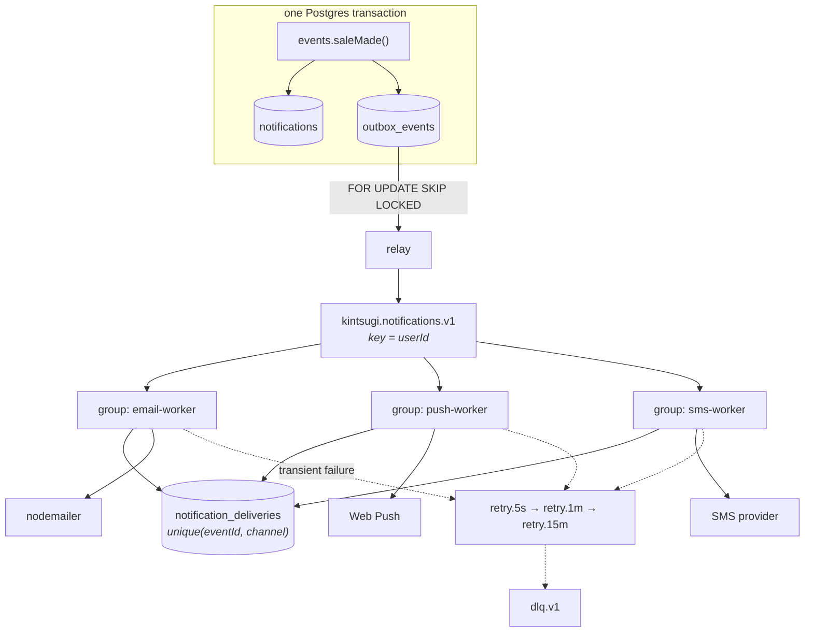

# Plan 0001 — Multi-channel notifications on Kafka

- **Status:** **Every phase has landed**, plus three that were not planned —
  3a, 4a and 6a. Completed 2026-09-07.
- **Written:** 2026-09-04
- **Produces:** ADRs 0024–0028

> **This was a plan, and it is now a record.** When it was written, most of this
> file described code that did not exist. All of it exists now: the outbox and
> relay, the retry ladder, email, web push, SMS on Twilio, quiet-hours deferral,
> the measurements, and the operational surface.
>
> **The header rule said this file gets deleted when the last phase lands.**
> It is being kept, and the reason is the three unplanned phases. Each one
> exists because a phase was declared done while something it had argued for was
> missing:
>
> - **3a** — the retry ladder was designed in phase 1 and never wired.
>   `RETRY_LADDER` was an exported constant nothing imported.
> - **4a** — quiet hours shipped as a drop, not a deferral, which is what §6
>   had committed to.
> - **6a** — the stale-`PENDING` sweeper ADR 0026 specified went unbuilt through
>   four phases, and was only forced into the open by a demo script that had to
>   be taught a `PENDING` row is a loss and not a delivery.
>
> Deleting the file would delete that pattern along with it. The ADRs carry the
> decisions; this carries the record of what got missed and how, which is the
> part a future plan can actually learn from.
>
> Where a section has been overtaken by what was measured — §4's partition
> ceiling, §6's quiet-hours timezone — the correction sits next to the original
> claim rather than replacing it.

---

## 1. Where notifications stand today

`Notification` is the source of truth and the only delivery channel is the app
itself. `lib/notifications.ts` says so at the top, and commits to what has to
stay true when that changes:

> This table remains the source of truth, so adding mail later means reading
> from here rather than replacing it. Nothing below assumes a delivery channel.

Eleven call sites emit events, all through `events.*`:

| Module | Events |
| --- | --- |
| `lib/orders.ts` | `saleMade` (via `notifyMany` — one basket, several sellers) |
| `lib/sales.ts` | `orderShipped`, `orderDelivered`, `orderUnfulfillable` |
| `lib/refunds.ts` | `refundIssued` ×2 — the automatic path and the moderator path |
| `lib/moderation.ts` | `listingRemoved`, `accountSuspended`, `reportResolved` |
| `lib/reviews.ts` | `reviewReceived` |
| `lib/verification.ts` | `identityVerified`, `identityRejected` |

Every one is `void`-ed, and every emit swallows its own errors, deliberately:
failing to tell someone their item sold must not roll back the sale.

Three gaps, in increasing order of difficulty:

- **Email** — `lib/mailer.ts` exists, has three transports, and is used by
  nothing except verification and password reset. The blocker was never the
  transport. It was per-type preferences and an unsubscribe path, without which
  transactional mail becomes the reason somebody filters the domain to spam and
  then stops seeing the messages that matter.
- **Push** — nothing at all.
- **SMS** — nothing at all, and `User` has **no phone column**. `Address.phone`
  exists but is a delivery contact for a parcel; see §5.

---

## 2. Why the design is an outbox *and* Kafka, not Kafka alone

Kafka on its own would be a step backwards in correctness.

A notification and its published event are two writes to two systems. No
transaction spans them, so a process that dies between them leaves the row
without the event — or, with the publish first, the event without the row. Both
are silent. Neither is recoverable, because nothing anywhere records that the
pair was meant to be atomic.

This codebase does not accept that class of bug anywhere else. Stock is decided
under `SELECT … FOR UPDATE` ([ADR 0012](../adr/0012-row-locking-for-reservations.md)).
Payment is claimed with a conditional `UPDATE` before the provider is called
([ADR 0013](../adr/0013-payment-provider-seam.md)). Refund headroom is claimed
the same way ([ADR 0016](../adr/0016-refunds-claim-then-refund.md)). The rule is
identical in each: one system decides, atomically, and the external call happens
only after that decision is durable.

A **transactional outbox** is that rule applied to publishing. The event row is
written in the same transaction as the notification, so the two commit together
or not at all. A separate relay reads committed outbox rows and publishes them.
A crash anywhere leaves work visibly unfinished rather than silently lost.

With the outbox in place, Kafka is doing what it is genuinely good at:

- **fan-out** — one event, N channels, and adding a channel touches no producer
- **independent consumer scaling** — SMS is slow and email is not; they should
  not share a throughput budget
- **failure isolation** — a dead SMS provider must not stall email
- **replay** — a template bug is fixable by resetting an offset, rather than by
  reconstructing a day of events from logs

It also keeps the transport replaceable. Every call site talks to `events.*`,
which talks to the outbox. Swapping Kafka for something else later is a change
to the relay and the workers, not to eleven business modules.

---

## 3. Target architecture



Three properties this shape has to preserve:

**Postgres stays the only source of truth.** Kafka carries delivery, never
truth. The line ADR 0018 draws around Redis is drawn around Kafka here: losing
the entire cluster loses in-flight *deliveries*, and no notification, no order,
and no money. `notifications` is still what the app reads.

**Consumer groups are the fan-out mechanism.** One domain topic, three groups —
not three topics. Per-channel topics would force the relay to know the channel
set, so adding WhatsApp later would mean editing the producer. Groups make the
channel set a consumer-side concern, which is where it belongs.

**Nothing in the request path talks to Kafka.** The relay and the workers are
separate processes. A broker outage slows notifications and does not touch
checkout.

---

## 4. Topics and partitioning

| Topic | Partitions | Key | Retention |
| --- | --- | --- | --- |
| `kintsugi.notifications.v1` | 12 | `userId` | 7d |
| `kintsugi.notifications.retry.5s.v1` | 6 | `userId` | 1d |
| `kintsugi.notifications.retry.1m.v1` | 6 | `userId` | 1d |
| `kintsugi.notifications.retry.15m.v1` | 6 | `userId` | 1d |
| `kintsugi.notifications.dlq.v1` | 3 | `userId` | 30d |

### The partition key is `userId`, and this is the decision that matters

Kafka orders messages within a partition and makes no promise across them.
Keying by `userId` puts every event about one person on one partition, so "your
item sold" cannot overtake "your item shipped".

The tempting alternative — keying by `NotificationType` — is wrong twice over.
There are eleven types, so eleven partitions would carry all the traffic and the
rest none; `SALE_MADE` alone would be a hot partition while eight others idle.
And per-user ordering is destroyed, because one person's events are now spread
across every partition by type.

**12 partitions is the ceiling on consumers doing main-topic work.** A group cannot usefully
run more consumers than partitions — the extras idle. Raising the count later
rehashes keys, which breaks per-user ordering during the migration, so it is set
deliberately above current need.

`replication.factor` and `min.insync.replicas` come from environment, not from a
literal: 1 and 1 on a single-broker Compose stack, 3 and 2 anywhere real.

Stated more carefully than it was originally: once the retry ladder landed every
worker subscribes to the main topic *and* all three rungs, so a group has
12 + 6 + 6 + 6 = 30 partitions to distribute and can hold 30 members before
anyone is wholly idle. Past 12, though, a member holds no main-topic partition
and does nothing for the main flow. Measured in phase 5: at 15 consumers the
broker assigned main-topic partitions to 12 and nothing to 3.

### The retry ladder, and why retries are not in-process

A consumer that retries in place blocks its partition. One buyer with a dead
phone number would hold up every other user hashed to that partition — a
per-recipient failure escalating into a per-channel stall.

Republishing to a delay topic keeps the main partition moving. The consumer
commits its offset, the message waits elsewhere, and a worker on the delay topic
picks it up once the delay has elapsed. Three rungs, then the DLQ.

**What is retryable is decided per failure, not per exception.** A 5xx from a
provider, a timeout, or a connection reset is transient and rides the ladder. A
rejected address, an unsubscribed recipient, or a `410 Gone` push endpoint is
permanent — it goes to the ledger as `FAILED` and never retries, because
retrying it is how a sender reputation gets burned.

---

## 5. Schema additions

```prisma
/// A domain event, written in the SAME TRANSACTION as the thing it describes.
///
/// Publishing to Kafka directly from the emitting code would be a dual write:
/// two systems, no transaction between them, and a crash in the gap that is
/// both silent and unrecoverable. This row is what makes the pair atomic — it
/// commits with the notification or not at all, and the relay publishes only
/// what is already durable. Same discipline as claim-then-charge in ADR 0013.
model OutboxEvent {
  id            String    @id @default(uuid())
  /// Stable across every republish and redelivery. This is what consumers
  /// deduplicate on, so it is generated once, here, and never regenerated.
  eventId       String    @unique @default(uuid())
  aggregateType String
  aggregateId   String
  type          NotificationType
  /// The partition key, denormalised so the relay never joins to find it.
  userId        String
  payload       Json
  createdAt     DateTime  @default(now())
  /// Null means unpublished. The relay's entire working set.
  publishedAt   DateTime?
  attempts      Int       @default(0)
  lastError     String?

  @@index([publishedAt, createdAt])
  @@map("outbox_events")
}

enum DeliveryChannel { EMAIL PUSH SMS }
enum DeliveryStatus  { PENDING SENT FAILED SUPPRESSED }

/// Which channels actually delivered, and what the provider said back.
///
/// KAFKA IS AT-LEAST-ONCE. A rebalance, a redeploy, or a consumer that dies
/// after sending and before committing its offset all produce a redelivery, and
/// redeliveries are normal traffic rather than an error case — exactly as they
/// are for Stripe webhooks. The unique constraint below is what stops one
/// becoming a second SMS to somebody's phone at 3am.
///
/// SUPPRESSED is a real outcome, not a failure: the recipient had this channel
/// off, or was inside quiet hours. Recorded rather than dropped, so "why did I
/// not get a text" has an answer.
model NotificationDelivery {
  id                String          @id @default(uuid())
  eventId           String
  channel           DeliveryChannel
  status            DeliveryStatus  @default(PENDING)
  /// A REFERENCE to the provider's message, never its content.
  providerMessageId String?
  attempts          Int             @default(0)
  lastError         String?
  createdAt         DateTime        @default(now())
  completedAt       DateTime?

  /// THE IDEMPOTENCY GUARD. Inserted before the provider is called, so a
  /// redelivery collides here and stops rather than sending twice.
  @@unique([eventId, channel])
  @@index([status, createdAt])
  @@map("notification_deliveries")
}

/// An explicit opt-in or opt-out. ABSENT MEANS "use the default for this type"
/// — see §6. Storing only the deviations keeps a new event type from needing a
/// backfill across every user before it can be sent at all.
model NotificationPreference {
  id      String           @id @default(uuid())
  userId  String
  user    User             @relation(fields: [userId], references: [id], onDelete: Cascade)
  type    NotificationType
  channel DeliveryChannel
  enabled Boolean

  @@unique([userId, type, channel])
  @@index([userId])
  @@map("notification_preferences")
}

/// Web Push, one row per browser profile — NOT per user. Somebody signed in on
/// a laptop and a phone has two, and both should ring.
model PushSubscription {
  id         String   @id @default(uuid())
  userId     String
  user       User     @relation(fields: [userId], references: [id], onDelete: Cascade)
  /// Unique because the browser regenerates it on resubscribe, and a stale
  /// duplicate would deliver the same notification twice to one device.
  endpoint   String   @unique
  p256dh     String
  auth       String
  userAgent  String?
  createdAt  DateTime @default(now())
  lastSeenAt DateTime @default(now())

  @@index([userId])
  @@map("push_subscriptions")
}

/// Proof that whoever holds this account also holds this phone.
///
/// Mirrors EmailVerificationToken deliberately: hashed, single-use, short
/// expiry. Shorter than email's, because an SMS code is six digits and lands in
/// a notification shade rather than behind a login.
model PhoneVerification {
  id         String    @id @default(uuid())
  userId     String
  user       User      @relation(fields: [userId], references: [id], onDelete: Cascade)
  /// E.164, normalised before storage.
  phone      String
  codeHash   String
  attempts   Int       @default(0)
  createdAt  DateTime  @default(now())
  expiresAt  DateTime
  consumedAt DateTime?

  @@index([userId])
  @@map("phone_verifications")
}
```

On `User`: `phone String?`, `phoneVerifiedAt DateTime?`, `smsConsentAt DateTime?`.

### Why `Address.phone` must not be reused

It is a delivery contact for a parcel. It is frequently the *recipient's* number
rather than the account holder's — gifts, deliveries to a workplace, an elderly
relative's landline — and it is typed into a checkout form with no verification
whatsoever.

Texting it would mean sending account notifications to a third party who never
consented and cannot unsubscribe. That is wrong on its own terms and unlawful
under most SMS consent regimes. The contact number needs its own field, its own
proof of possession, and its own recorded consent timestamp. Nothing is ever
sent to a number whose `phoneVerifiedAt` is null.

Same reasoning as [ADR 0006](../adr/0006-kyc-store-reference-not-document.md):
the cheap shortcut creates a liability far more expensive than the work it
avoided.

---

## 6. Channel policy

Defaults per event, overridable per user through `NotificationPreference`. This
table is the difference between notifications people trust and notifications
people mute.

| Event | Recipient | In-app | Email | Push | SMS |
| --- | --- | --- | --- | --- | --- |
| `SALE_MADE` | seller | ✓ | ✓ | ✓ | opt-in |
| `ORDER_SHIPPED` | buyer | ✓ | ✓ | ✓ | — |
| `ORDER_DELIVERED` | seller | ✓ | — | ✓ | — |
| `ORDER_UNFULFILLABLE` | buyer | ✓ | ✓ | ✓ | **on** |
| `REFUND_ISSUED` | buyer | ✓ | ✓ | ✓ | **on** |
| `REVIEW_RECEIVED` | seller | ✓ | — | ✓ | — |
| `IDENTITY_VERIFIED` | seller | ✓ | ✓ | ✓ | — |
| `IDENTITY_REJECTED` | seller | ✓ | ✓ | ✓ | — |
| `LISTING_REMOVED` | seller | ✓ | ✓ | ✓ | — |
| `ACCOUNT_SUSPENDED` | user | ✓ | ✓ | — | — |
| `REPORT_RESOLVED` | reporter | ✓ | — | ✓ | — |

The two unusual rows, and why:

**SMS defaults on for exactly two events.** Both are cases where money moved, or
where an item that was paid for is not coming. SMS costs money per message and
spends goodwill that cannot be earned back, so the bar is "this person needs to
know now, away from a screen" — which `REVIEW_RECEIVED` does not clear.

**`ACCOUNT_SUSPENDED` gets no push.** A suspended user cannot open the app, so a
push notification leads to a login screen that refuses them. Email leaves them
something to read and something to appeal against.

In-app is unconditional in every row: it is the ledger, and preferences govern
delivery, not the record.

**Quiet hours apply to SMS only**, by the recipient's timezone, deferring rather
than dropping. Email and push are silent by nature and do not need them.

---

## 7. Testing

The suite drives the real stack and mocks nothing, on the grounds that the bugs
worth catching live in the seams between the pieces. A broker is a seam, so it
should be tested — but adding one to every CI run would slow a ten-minute
pipeline and give fork pull requests one more piece of infrastructure to depend
on.

The codebase already solved this shape of problem twice, with the payment and
identity provider seams. Same answer:

```
NOTIFY_TRANSPORT=inline   # default. The relay hands events straight to the
                          # consumer functions in-process. Same consumer code,
                          # no broker. What the suite and CI run.

NOTIFY_TRANSPORT=kafka    # the real transport. Local, and everywhere real.
```

Consumers are plain `async (event) => …` functions under both, so `inline`
exercises preference resolution, the idempotency guard, template rendering, and
the provider seams for real. Only the transport is absent.

One caveat found the hard way: `inline` only stays broker-free if the Kafka
client is never *loaded*. It is a native addon, so a top-level import of it
pulls librdkafka into the process the moment anything reads a topic name — and
a `node_modules` built for another platform then fails the whole application at
`require`, on the transport whose entire purpose is needing no broker. The
import in `lib/kafka.ts` is therefore type-only, and the runtime `require` sits
inside `kafka()`, reached only by code about to talk to a broker.

What only a broker can demonstrate lives in `tests/api/retry-ladder.ts`, gated
on `KAFKA_BROKERS` the way `ratelimit` and `cache` are gated on `REDIS_URL`:

- a failed message is republished onto the right rung, keyed by `userId` so a
  retry cannot overtake a later notification for the same person, and carrying
  the attempt count, the target group, and why it failed — **covered**
- a message that exhausts the ladder arrives in the DLQ with that history —
  **covered**
- an offset is committed only **after** the ledger row is written, so a consumer
  killed between the two redelivers and deduplicates rather than losing the
  send — **covered**, by `scripts/consumer-failure-demo.ts`: SIGKILL with 2,215
  of 3,000 events outstanding, 0 lost
- a consumer group rebalances without duplicate delivery — **covered**, same
  run: the survivors finished the dead consumer's partitions, 0 duplicates
- a rung's message is not processed before its delay elapses — **partly**. A
  message replayed onto the 5s rung was observed arriving after the delay and
  not before, but that is an observation from the DLQ tool rather than an
  assertion in a suite
- a consumer killed *between* claiming a delivery and settling it leaves a
  `PENDING` row nothing will ever retry — **covered**, by phase 6a. The
  per-channel sweeper ADR 0026 specifies now exists, and
  `tests/api/operations.ts` asserts email is resent, SMS is not, and two
  sweepers racing one row resolve it exactly once

Following the precedent in `tests/README.md`, the gated sections **skip loudly**
rather than passing quietly when the broker is absent, and the skip names the
claims that went unproven rather than merely saying it was skipped.

---

## 8. Phases

Each phase ships on its own and leaves the system working. No phase depends on a
later one.

### ~~Phase 0 — Decide, and write it down~~ · landed 2026-09-04

Four ADRs, no code:

| ADR | Decision |
| --- | --- |
| 0024 | Transactional outbox, not dual writes |
| 0025 | Kafka topics, `userId` as partition key, retry ladder over in-process retry |
| 0026 | Delivery idempotency: the ledger, and the unique constraint that enforces it |
| 0027 | Notification consent: verified phone, per-type preferences, unsubscribe |

The ADRs in this repository are load-bearing — they carry the reasoning the code
cannot. Writing them first is how the design gets argued before it gets built,
and §2, §4, and §5 above are already most of their content.

**Exit:** four records merged, each with its rejected alternatives.

### ~~Phase 1 — Outbox, relay, broker~~ · landed 2026-09-04

- `OutboxEvent` model and migration.
- `lib/outbox.ts` — one function, `enqueue(tx, event)`, taking a transaction
  client so it cannot be called outside one.
- `notify()` and `notifyMany()` rewritten to wrap the notification insert and
  the outbox insert in one `prisma.$transaction`. **All eleven call sites stay
  untouched** — that is what the `events.*` layer is for.
- `lib/relay.ts` — polls with `SELECT … FOR UPDATE SKIP LOCKED`. `FOR UPDATE` is
  the same lock discipline as `lib/reservations.ts`; `SKIP LOCKED` is what lets
  N replicas poll one table without double-publishing, since a row already
  claimed by another relay is passed over instead of waited on. Shaped like the
  two existing sweepers (`startOrderSweeper`, `startReservationSweeper`), which
  have the same "recover state nothing in the request path can reach" job.
- Kafka in `docker-compose.yml` in **KRaft mode — no ZooKeeper**, behind a
  `messaging` profile so a plain `docker compose up` stays lean.
- Two new Dockerfile targets, `relay` and `worker`, per
  [ADR 0023](../adr/0023-one-dockerfile-many-targets.md). Separate processes, so
  they scale and fail independently of the API and map onto Kubernetes
  Deployments later.
- A consumer that only logs.

**Exit:** an event provably reaches a consumer exactly once, with the relay
SIGKILLed mid-batch.

**Met.** `tests/api/outbox.ts` — 28 assertions, no API and no broker, about a
second. It forces open the three gaps a happy path never reaches: a transaction
rolled back after both writes leaves neither row; two concurrent relay passes
over 24 events deliver each exactly once (a plain `SELECT` delivers all 24
twice); and a publish that throws leaves the row unpublished with the attempt
and the reason recorded, then recovers on the next pass.

Two answers came out of building it rather than planning it:

- **The Kafka client is `@confluentinc/kafka-javascript`** — open question 2,
  settled by evidence rather than preference: `kafkajs` last published
  2023-02-27, the Confluent package a week before this was written.
- **The relay gets its own process, but only under `kafka`** — open question 4.
  Under `inline` there is no broker and nothing to scale, so the API runs it
  in-process and development stays one process.

### ~~Phase 2 — Email~~ · landed 2026-09-04

- `NotificationDelivery` and `NotificationPreference` models.
- Preference resolution: explicit row, else the §6 default.
- Email worker: claim in the ledger → render → send through the existing
  `lib/mailer.ts`, unchanged → record the provider id.
- Templates per type, plain text and HTML.
- Signed unsubscribe tokens; one-click unsubscribe headers.
- `/account/notifications` gains a preferences panel.

**Exit:** the promise in the `lib/notifications.ts` header is discharged — mail
goes out, reading from the notification table rather than replacing it, with the
preferences and unsubscribe path that were the actual blocker all along.

**Met.** `tests/api/email-delivery.ts` — 26 assertions. The ledger claim is
exercised under redelivery rather than assumed: the same event delivered twice
produces one send and one `duplicate`, a channel the recipient turned off lands
as `SUPPRESSED` with a reason rather than vanishing, and an unverified address
fails rather than suppressing, because suppression would claim the recipient
chose it.

### ~~Phase 3 — Web Push~~ · landed 2026-09-04

Web Push over FCM/APNs because there is no mobile app: no store, no native
build, and it works in the browser that is already open.

- VAPID keypair; `assertPushConfigured()` at startup beside the existing checks.
- `PushSubscription` model, subscribe and unsubscribe endpoints.
- Service worker in the Next app; permission requested **on a user action**,
  never on page load.
- `410 Gone` and `404` from the push service delete the subscription — that is
  the protocol saying the browser is gone, not a transient failure.

**Exit:** one notification reaches two devices signed in as the same user, and a
revoked subscription cleans itself up.

**Met.** `tests/api/push-delivery.ts` — 20 assertions. A user with two
subscriptions gets one delivery row and two device sends; a `410 Gone` deletes
the subscription rather than retrying it; and a user with no devices records
`SUPPRESSED`, not `FAILED`, because having never granted permission is the
ordinary state of most accounts and painting the ledger red for it would make
the ledger useless for spotting the real failures.

### ~~Phase 3a — The retry ladder, wired~~ · landed 2026-09-06

Not a planned phase. §4 and ADR 0025 argued the ladder as part of phase 1, and
phase 1 shipped the topics without it — `RETRY_LADDER` was an exported constant
that nothing imported, the worker subscribed to the main topic alone, and a
transient failure was therefore terminal. A provider having a bad minute lost
the notification outright, which is the failure the ladder exists to prevent
and the one the design claimed was handled.

What closing it actually needed, beyond the republish itself:

- **A failure has to be classified before it can be routed.** `deliver()` now
  returns `retry` or `failed`, and `PermanentFailure` is what a channel throws
  to mean "this will be refused again for the same reason". Anything not
  wrapped is transient, because the costs are asymmetric — an unnecessary retry
  wastes one send, a missing one loses the notification.
- **The idempotency guard had to learn one exception.** The unique constraint
  that makes redelivery safe (ADR 0026) makes a retry look *identical* to a
  duplicate, so without a deliberate reclaim the ladder would have run three
  rungs and delivered nothing, silently. `claim({ reclaim: true })` — passed
  only by the ladder, never on the main topic — takes over a row that is
  `FAILED` and nothing else, by conditional update, so two workers racing the
  same retry produce one send.
- **The delay is a pause, not a sleep.** Awaiting inside the handler holds the
  poll loop; hold it past `max.poll.interval.ms` — five minutes, against a 15m
  rung — and the broker evicts the consumer and the group rebalances forever.
  The partition is paused and the offset sought back instead, so the consumer
  keeps its membership and only that one partition stops.
- **Retries are tagged with the group they are for.** Every group subscribes to
  every rung, so without the tag an email failure would be reprocessed by the
  push worker. The ledger would refuse it, but the work and the noise are
  avoidable for the cost of one header.

**Exit:** a transient failure climbs the ladder and a permanent one does not,
with no send duplicated on the way.

**Met, in part.** `tests/api/retry-ladder.ts` — 38 assertions with no broker,
covering the routing table, the header parsing, and every case reclaim must
refuse: a `SENT` row, a `PENDING` row that belongs to a live attempt, a
`SUPPRESSED` row, and two workers racing the same retry. A broker-gated section
asserts what goes onto the wire.

**Still owed, and skipping loudly until it exists:** the two claims that need a
running worker rather than only a broker — that a rung's message is not
processed before its delay elapses, and that an offset is committed only after
the ledger row is settled.

### ~~Phase 4 — SMS~~ · landed 2026-09-06

- `phone`, `phoneVerifiedAt`, `smsConsentAt` on `User`; `PhoneVerification`.
- E.164 normalisation on input; a code sent and verified before the number is
  usable; rate-limited through the existing `lib/rateLimit.ts` — send *and*
  verify, both, because an unlimited verify endpoint is a six-digit oracle, the
  same reasoning that puts a limit on `admin-stepup`.
- Provider seam, `SMS_PROVIDER=stub|twilio`, mirroring payments and identity, so
  CI never sends a message and never needs a secret.
- Quiet hours; a hard per-user daily cap; permanent failures never retried.

**Exit:** SMS to verified numbers only, never outside quiet hours, never twice
for one event, and never at all in CI.

**Met.** `tests/api/sms-delivery.ts` — 55 assertions, against
`SMS_PROVIDER=stub`, so the whole path runs and only the carrier is absent.
E.164 normalisation including the cases it must reject; a code that is
single-use, expiring, and attempt-capped — past the cap even the *correct* code
is refused; one number cannot be verified on two accounts; an account with no
number records `SUPPRESSED` with a reason rather than `FAILED`, and withdrawn
consent records a *different* reason; a redelivery sends no second text; the
daily cap holds; and the quiet-hours window is asserted across midnight, which
is where the obvious implementation is wrong in a way that looks configured and
does nothing.

Also asserted, because it is the trap [ADR 0027](../adr/0027-notification-consent-and-preferences.md)
exists to close: **saving an address leaves `User.phone` untouched.**

The provider decision is [ADR 0028](../adr/0028-sms-provider-twilio-behind-a-seam.md)
— Twilio, over its REST API rather than the SDK, chosen over SNS on opt-out
handling and error taxonomy rather than on price.

**One thing this did NOT deliver, against the §6 commitment above:**

- **Quiet hours use the server's timezone, not the recipient's.** There is no
  `timezone` column on `User`. A user in Sydney is currently quiet during the
  server's night rather than their own. Closing it is a column captured at
  signup, and the window arithmetic already takes a zone — it is simply given
  the server's.

### ~~Phase 4a — Quiet hours defer instead of dropping~~ · landed 2026-09-06

Phase 4 shipped quiet hours as a *suppression*, which is a drop wearing a
better name, and §6 says defer. The argument for letting it stand was that both
SMS-default events also go by email and push — true today, and not a property
anyone should have to keep true for the SMS path to be correct.

- `DeliveryStatus.DEFERRED` and `notification_deliveries.notBefore`. A parked
  message is a distinct state from a suppressed one, because SUPPRESSED is
  terminal and the whole point is that this message is still owed.
- `lib/deferredDeliveries.ts` — a sweeper, shaped like `startReservationSweeper`
  and `startOrderSweeper`, claiming with a conditional `UPDATE` so N API
  replicas divide the work rather than sending it N times.
- **Not a fourth rung on the retry ladder.** A rung waits by pausing its
  partition, and an eight-hour pause holds that partition open all night for
  everything behind it. The ladder is built for minutes.
- **The text is read back from `notifications`, not snapshotted onto the
  delivery row.** That table is the source of truth; a copy would be a second
  version of the same sentence, free to drift.
- A maximum age, default 24h. A refund text two days late re-alarms somebody
  about something already resolved — past the cap it settles `SUPPRESSED` with
  a reason rather than arriving unexplained.

**Exit:** a message parked at 3am is sent when the window opens, once, by
exactly one replica.

**Met.** Sections 9-9d of `tests/api/sms-delivery.ts`: `opensAt` is the moment
the window closes *including when that is tomorrow*; a row not yet due is left
alone; once due it is sent and `notBefore` cleared, and a second pass finds
nothing; two sweepers racing one parked message produce exactly one send; and a
message parked past the cap is dropped with a reason rather than sent late.

### ~~Phase 5 — Prove the scaling claim~~ · landed 2026-09-07

This repository does not assert performance, it measures it — `cache-demo.ts`
counts Postgres's own `xact_commit` rather than trusting an app-side counter,
and `ratelimit-demo.ts` shows the limits coming apart before it shows them
holding. Kafka is being introduced *for* scale, so the same standard applies.

- `scripts/notification-throughput-demo.ts` — 10k events; end-to-end p50/p95 lag
  at 1, 3, 6, and 15 consumers per group. The honest result includes the
  **flattening at 12**, where consumers exceed partitions and the extras idle.
- `scripts/consumer-failure-demo.ts` — SIGKILL a consumer mid-batch; count
  duplicate deliveries in the ledger (must be 0) and lost events (must be 0).
- `scripts/dlq-replay.ts` — an operator tool, not a demo. Replay a DLQ partition
  once the cause is fixed.

**Exit:** numbers in the README, in the existing style, including the ones that
are unflattering.

**Met, and the numbers are worse than this section assumed.** All three scripts
exist and have run against a real single-broker KRaft cluster.

`notification-throughput-demo.ts` — 10k events, 500 recipients, the real email
consumer group, at 1/3/6/12/15 consumers:

| Consumers | p50 | p95 | Events/sec | Main-topic partitions assigned |
| --- | --- | --- | --- | --- |
| 1 | 56.3s | 88.3s | 109 | 1/1 |
| 3 | 47.8s | 71.1s | 136 | 3/3 |
| 6 | 38.0s | 54.5s | 174 | 6/6 |
| 12 | 33.8s | 50.0s | 189 | 12/12 |
| 15 | 33.1s | 52.6s | 170 | **12/15** |

- **The flattening this section predicted is there, and it arrives earlier than
  12.** Twelve times the consumers buys 1.7x the throughput. Measured on 4 CPUs
  with a process per consumer, so part of that is contention rather than design
  — which is why the ceiling is proven from the *assignment* column instead.
- **The partition ceiling is measured, not inferred.** At 15 consumers the
  broker gave main-topic partitions to 12 and nothing to 3, and throughput
  *fell* from 189 to 170. The number comes from asking the broker which member
  owns which partition, because a slow machine produces an identical curve for
  a completely different reason.
- **The broker is not the bottleneck, and that is the finding that matters.**
  The relay publishes at 3,400-4,600/sec while consumers drain at 109-189/sec —
  a gap of more than twenty times. What is slow is the per-event database work
  inside the consumer. So the *throughput* half of §2's case for Kafka is its
  weakest half, and §9's admission that "at this traffic a table and a worker
  would do" is now measured rather than conceded. Fan-out, failure isolation,
  and replay are what earn it.

`consumer-failure-demo.ts` — SIGKILL with 2,215 of 3,000 events outstanding:
**0 duplicates, 0 lost, 0 stuck PENDING**, all 3,000 delivered exactly once. It
also prints what it did not prove — nothing was killed inside the claim-to-settle
window, so the ambiguous middle of
[ADR 0026](../adr/0026-delivery-idempotency.md) remains untested and its
per-channel sweeper remains unbuilt.

`dlq-replay.ts` — an operator tool, report-only unless given `--commit`.
Replays to the **5s rung rather than the main topic**, and that is the one
non-obvious thing in it: a DLQ entry already has a `FAILED` ledger row, the main
topic is consumed with the strict claim, so a replay there collides with its own
row and is dropped while the logs show success. Verified end to end — replayed,
picked up one rung later, `SENT` with `attempts=2`.

**One correction to §4 that this phase forced.** "12 partitions is the ceiling
on consumers per group" is too loose. Since the ladder landed, every worker
subscribes to the main topic *and* all three rungs, so the group has 30
partitions to hand out and can hold 30 members before anyone is wholly idle.
What is true is narrower: past 12, a consumer holds no *main-topic* partition
and contributes nothing to the throughput above, however busy it looks.

### ~~Phase 6 — Operations~~ · landed 2026-09-07

- Consumer lag at `/health/lag`; an alert on DLQ depth.
- The delivery ledger surfaced in the admin panel — "did the buyer actually get
  the refund email?" is a real support question with no current answer.
- Retention and cleanup for `outbox_events`, whose published rows otherwise grow
  without bound.

**Exit:** a moderator can answer a delivery question without a database console.

**Met.** `/admin/deliveries` — search by email address or name, because that is
what a support conversation actually starts with; eventId too, for whoever is
holding a DLQ entry. Filters by channel and status, counts the whole filtered
set rather than the page, and every row carries **why**: `suppressReason` for a
channel the recipient turned off, `lastError` for a provider that refused,
`notBefore` for something quiet hours parked. An answer of "FAILED" with no
reason sends the reader straight back to the database.

Two deliberate omissions: no message body — the ledger records that something
was sent, not what it said (ADR 0026) — and `SUPPRESSED` is styled neutral
rather than red, because it is the recipient's choice or a policy working, and
colouring it as a fault would make the page look like an incident every time
somebody turns off review emails.

`GET /health/lag` — per-group lag, per-topic breakdown, DLQ depth, and the
thresholds themselves so a monitor need not encode them. 503 when unhealthy, so
nothing has to parse a body to know. It reports **all four rungs**, not just the
main topic: a group stalled on `retry.15m` is a real failure that main-topic lag
shows as zero.

- **It does not alert, and says so.** There is no alerting stack here, and
  pretending otherwise would be worse than the gap — the same line
  [ADR 0020](../adr/0020-replication-and-backups.md) draws around a Postgres
  standby with no orchestrator.
- **Unreachable is unhealthy.** A health check that returns 200 because it
  could not determine anything is worse than one that fails: the monitor goes
  green and the person on call hears it from a customer.

**Two bugs this phase produced, both found by running it:**

- **The first version reported zero lag while nothing was consuming** — the
  exact failure the endpoint exists to prevent. It iterated the group's
  committed offsets, and `fetchOffsets` returns an *empty array* for a group
  that has never run, not a list of -1s. It now derives lag from the topic's
  partition list and counts a never-committed partition's whole retained
  backlog, with `uncommitted` exposed separately so "never started" stays
  distinguishable from "fallen behind".
- **The thresholds were captured at module load**, so the unhealthy branch
  could not be tested — the same mistake as the SMS daily cap two phases
  earlier. Read per call now, and `tests/api/operations.ts` asserts the 503
  path actually fires.

### ~~Phase 6a — The ambiguous middle, closed~~ · landed 2026-09-07

Not a planned item. [ADR 0026](../adr/0026-delivery-idempotency.md) specified a
per-channel sweeper for stale `PENDING` rows and it went unbuilt through four
phases. `scripts/consumer-failure-demo.ts` is what made it undeniable: its first
version counted a `PENDING` row as a delivery, and had to be taught that a row
claimed and never settled is a notification **lost behind something that looks
like proof it was sent**.

`lib/stalePending.ts` resolves them on the policy the ADR already chose, and the
policies differ because the cost of guessing wrong differs:

- **Email and push are resent.** A duplicate is an annoyance; a missing refund
  notice is not. Push reuses the original `eventId` as its collapse tag, so if
  the first attempt did land the device replaces it rather than showing two.
- **SMS is never resent.** It settles `FAILED` and is flagged for a human,
  because a duplicate text costs real money and reads to the recipient exactly
  like a phishing retry — which they cannot distinguish from the real thing.

The SMS branch returns *before* anything is sent, so the decision not to resend
cannot depend on a later branch being reached. Claiming is a conditional
`UPDATE` on `status: PENDING` plus the age bound, so two API replicas cannot
both resend the same message.

**Exit:** no delivery stays `PENDING` forever, and no SMS is ever resent on a
guess.

**Met.** `tests/api/operations.ts` — 32 assertions. A row merely in flight is
left alone; a stale email settles `SENT` with the extra attempt recorded; a
stale SMS settles `FAILED` flagged for review; two sweepers racing one row
resolve it exactly once. Retention deletes aged published rows, keeps recent
ones, and **keeps an unpublished row at any age** — that one is work still owed,
and deleting it would destroy the notification and the evidence in one
statement.

---

## 9. What this costs, and what it does not do

**Three more processes to run** — broker, relay, worker — and one more stateful
system to operate. Kafka being down becomes a thing that happens, and it needs a
defined answer rather than an assumed one: notifications queue in the outbox and
drain when it returns. That is why the outbox is load-bearing rather than
ceremony.

**Kafka is oversized for one broker on Compose, and ADR 0025 should say so out
loud.** At this traffic a table and a worker would do. It earns its place on the
fan-out, on independent consumer scaling, and on replay — and the outbox means
the transport could be swapped later without touching a call site. An ADR that
pretended the choice was obvious would be exactly the kind of document
`docs/README.md` warns about.

**No orchestration.** Nothing here promotes a broker, rebalances after a node
loss, or replaces a dead worker. That is an orchestrator's job, and it is the
same gap already recorded for the Postgres standby in
[ADR 0020](../adr/0020-replication-and-backups.md).

**Exactly-once is not claimed.** Kafka is at-least-once and the ledger makes
delivery idempotent, which is a different and weaker guarantee than exactly-once
end to end. A provider that accepts a message and then fails to return an id can
still produce a duplicate at the far end. This is at-least-once sending with a
very small duplicate window, and saying otherwise would be a lie.

**Ordering holds per user, not globally.** Two events for one person keep their
order. Two events for two people have no relative order at all, and nothing
should be built that assumes one.

---

## 10. Open questions

1. **Debezium instead of a polling relay?** CDC off the WAL — which is already
   being archived for [ADR 0020](../adr/0020-replication-and-backups.md) — is
   the more rigorous answer, and removes the polling interval from the latency
   budget. It also adds Kafka Connect, a large operational surface for a system
   that already has two sweepers doing this shape of work. **Recommendation:
   polling relay in Phase 1, Debezium recorded as an upgrade path in ADR 0024.**
2. **Kafka client.** `@confluentinc/kafka-javascript` (librdkafka-based,
   officially supported, KafkaJS-compatible API) over `kafkajs`. Verify current
   maintenance status before committing — this landscape moves.
3. ~~**SMS provider.**~~ **Answered: Twilio**, over its REST API rather than the
   SDK, with `stub` remaining the default so CI never sends and never needs a
   secret. Decided on opt-out handling and error taxonomy rather than on price —
   SNS is cheaper and loses on both. Recorded as
   [ADR 0028](../adr/0028-sms-provider-twilio-behind-a-seam.md).
4. **Does the relay live in the API process or its own?** Its own is proposed
   above, for independent scaling and a separate failure domain. In-process
   would match the existing sweepers and add no container. The tradeoff is real
   and worth ten minutes before Phase 1 starts.
